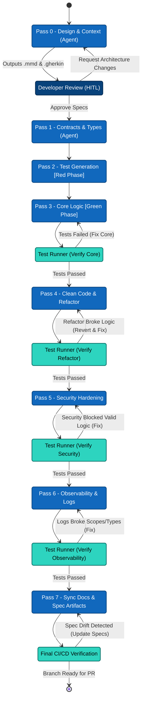

# agentic-tdd

**An artifact-driven, 8-pass agentic pipeline for enterprise software development using OpenCode.**

> _"Stop asking AI to write code. Start orchestrating AI to build software."_

[](https://www.gnu.org/licenses/agpl-3.0)
[](https://nodejs.org)
[](https://www.typescriptlang.org)

---

## The Problem

Ad-hoc agentic coding fails at the enterprise level for multiple reasons:

1. **Context Bloat** — Dumping entire codebases into a single prompt burns millions of tokens and causes "lost in the middle" attention drift.
2. **Spaghetti Edits** — Asking one model to write logic, enforce security, and format logs simultaneously causes "lazy coding" on at least one constraint.
3. **Specification Drift** — Agents change the code but leave the architecture docs untouched, creating a legacy codebase on day one.
4. **Lack of Formal development Process and quality gating** - This leads to inconsistent code quality, security vulnerabilities, and drift from the intended architecture.

## The Solution: AI as an Assembly Line

Instead of a zero-shot prompt, this framework breaks software development into a **strict 8-pass sequential pipeline**. Each pass is handled by a specialized sub-agent with a deeply constrained scope.

```
Pass 0  Design & Architecture  →  design.mmd + spec.gherkin  [HITL gate]
Pass 1  Contracts & Types      →  type stubs in source files
Pass 2  TDD Test Generation    →  test file                   [Red Phase]
Pass 3  Core Implementation    →  logic                       [Green Phase + self-correction]
Pass 4  Refactor & Optimise    →  complexity/DRY              [self-correction]
Pass 5  Security Hardening     →  Secure Code + OWASP         [self-correction]
Pass 6  Observability & Logs   →  logging + error classes     [self-correction]
Pass 7  Documentation          →  docstrings + @see links
```

Each guarded pass runs your local test suite and self-corrects (up to 2 retries) before advancing. Every pass produces an **atomic git commit** — so if an agent breaks something, you `git revert` one step and retry.

---

## Architecture at a Glance




### Three Cost-Critical Invariants

| Invariant | What it does |
|---|---|
| **Static Prefix** | Files are attached in a locked order (`design.mmd` → `spec.gherkin` → source code). Every pass shares the same cacheable prefix → ~90% discount on input tokens. |
| **Context Compaction** | Error logs are written to `.opencode_error.log`, then deleted the moment tests pass. No debugging context bleeds across passes. |
| **Single-Model Lock** | Model is declared in each agent's YAML frontmatter — never overridden by the orchestrator. Cache pool stays intact. |

---


## Quick Start

### Prerequisites

- **Node.js >= 22**
- [opencode CLI](https://opencode.ai) 
- An API key - [OpenRouter](https://openrouter.ai) or Claude or openAi codex (or configure opencode to use free models on openrouter or opencode Zen.)
- `git` initialized in your working directory

### 1. Install dependencies

```bash
git clone https://github.com/Nistapp/agentic-tdd.git
cd agentic-tdd
npm install
```

### 2. Build the TypeScript source

```bash
npm run build
```

### 3. Link globally (optional — for `agentic-tdd` on your PATH)

```bash
npm link
```

### 4. Configure your API key

```bash
cp .env.example .env
# Edit .env and add your OPENROUTER_API_KEY
```

### 6. Run against your own file

```bash
npx agentic-tdd --feature-desc-file ./src/artefacts/Prompt-3.md --log-level DEBUG --test-cmd "pytest"
```

If you ran `npm link`, you can also use the bare command:

```bash
agentic-tdd --feature-desc-file specs/my_feature.md --skip-hitl --test-cmd "pytest"
```

---

## CLI Usage

```
agentic-tdd -feature-desc-file <spec_file> [options]
```

### Options

| Command | Description |
| :--- | :--- |
| -V, --version | output the version number |
| --feature-desc-file <path> | Path to the feature description file (e.g. specs/feature.md) |
| --test-cmd <command> | Test command to run after each pass (language-specific) |
| --skip-hitl | Skip human-in-the-loop prompts |
| --base-branch <branch> | Base branch to create the feature branch from |
| --log-level <level> | Log level (DEBUG, INFO, WARNING, ERROR) (default: "INFO") |
| --resume | Resume an active Agentic TDD session |
| --abort | Abort the active session and rewind Git history |
| -h, --help | display help for command |


---

## Agent Configuration

Agents are defined in `src/agents/`. Each agent file has YAML frontmatter that locks the model, permissions, and scope.

The pipeline enforces that agents can only:

- **Read**: their assigned files (`design.mmd`, `spec.gherkin`, source code)
- **Write**: only the files appropriate to their pass (e.g., the Docs agent can only edit comments)
- **Execute**: nothing — no bash, no web fetch

See `docs/architecture-manifesto.md` § 4 for the full agent guardrail design.

---

## Uninstall

To remove the CLI:

```bash
# If installed via npm link
npm unlink -g agentic-tdd

# If installed via npm install -g
npm uninstall -g agentic-tdd
```

---

## License

GNU Affero General Public License v3.0 — see [LICENSE](LICENSE) for details.

This means: you can use, study, and modify this freely. If you run a modified version as a network service, you must release your modifications under the same license.
