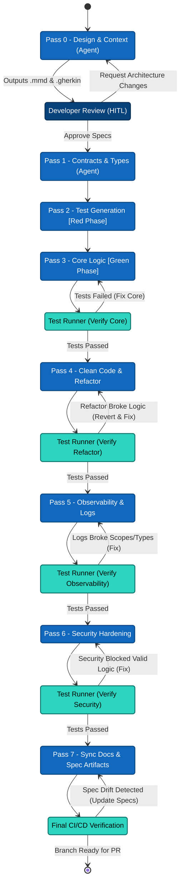

# agentic-tdd

**An artifact-driven, 8-pass agentic pipeline for enterprise software development using OpenCode.**

> _"Stop asking AI to write code. Start orchestrating AI to build software."_

[](https://www.npmjs.com/package/agentic-tdd)
[](https://www.npmjs.com/package/agentic-tdd)
[](https://www.gnu.org/licenses/agpl-3.0)
[](https://nodejs.org)
[](https://www.typescriptlang.org)

---

## The Problem

Ad-hoc agentic coding fails at the enterprise level for multiple reasons:

1. **Context Bloat** — Dumping entire codebases into a single prompt burns millions of tokens and causes "lost in the middle" attention drift.
2. **Spaghetti Edits** — Asking one model to write logic, enforce security, and format logs simultaneously causes "lazy coding" on at least one constraint.
3. **Specification Drift** — Agents change the code but leave the architecture docs untouched, creating a legacy codebase on day one.
4. **Lack of Formal development Process and quality gating** - This leads to inconsistent code quality, security vulnerabilities, and drift from the intended architecture.

## The Solution: AI as an Assembly Line

Instead of a zero-shot prompt, this framework breaks software development into a **strict 8-pass sequential pipeline**. Each pass is handled by a specialized sub-agent with a deeply constrained scope.

```
Pass 0  Design & Architecture  →  design.mmd + spec.gherkin  [HITL gate]
Pass 1  Contracts & Types      →  type stubs in source files
Pass 2  TDD Test Generation    →  test file                   [Red Phase]
Pass 3  Core Implementation    →  logic                       [Green Phase + self-correction]
Pass 4  Refactor & Optimise    →  complexity/DRY              [self-correction]
Pass 5  Observability & Logs   →  logging + error classes     [self-correction]
Pass 6  Security Hardening     →  Secure Code + OWASP         [self-correction]
Pass 7  Documentation          →  docstrings + @see links
```

Each guarded pass runs your local test suite and self-corrects (up to 3 retries) before advancing. Every pass produces an **atomic git commit** — so if an agent breaks something, you `git revert` one step and retry.

---

## Architecture at a Glance


```mermaid
stateDiagram-v2
    classDef human fill:#08427b,color:#fff,stroke:#052e56,stroke-width:2px
    classDef agent fill:#1168bd,color:#fff,stroke:#0b4884,stroke-width:2px
    classDef testGate fill:#2dd4bf,color:#000,stroke:#0f766e,stroke-width:2px

    [*] --> Pass_0

    Pass_0 : Pass 0 - Design & Context (Agent)
    class Pass_0 agent

    HITL : Developer Review (HITL)
    class HITL human

    Pass_0 --> HITL : Outputs .mmd & .gherkin
    HITL --> Pass_0 : Request Architecture Changes
    HITL --> Pass_1 : Approve Specs

    Pass_1 : Pass 1 - Contracts & Types (Agent)
    class Pass_1 agent

    Pass_2 : Pass 2 - Test Generation [Red Phase]
    class Pass_2 agent

    Pass_1 --> Pass_2
    Pass_2 --> Pass_3

    Pass_3 : Pass 3 - Core Logic [Green Phase]
    class Pass_3 agent

    Gate_3 : Test Runner (Verify Core)
    class Gate_3 testGate

    Pass_3 --> Gate_3
    Gate_3 --> Pass_3 : Tests Failed (Fix Core)
    Gate_3 --> Pass_4 : Tests Passed

    Pass_4 : Pass 4 - Clean Code & Refactor
    class Pass_4 agent

    Gate_4 : Test Runner (Verify Refactor)
    class Gate_4 testGate

    Pass_4 --> Gate_4
    Gate_4 --> Pass_4 : Refactor Broke Logic (Revert & Fix)
    Gate_4 --> Pass_5 : Tests Passed

    Pass_5 : Pass 5 - Observability & Logs
    class Pass_5 agent

    Gate_5 : Test Runner (Verify Observability)
    class Gate_5 testGate

    Pass_5 --> Gate_5
    Gate_5 --> Pass_5 : Logs Broke Scopes/Types (Fix)
    Gate_5 --> Pass_6 : Tests Passed

    Pass_6 : Pass 6 - Security Hardening
    class Pass_6 agent

    Gate_6 : Test Runner (Verify Security)
    class Gate_6 testGate

    Pass_6 --> Gate_6
    Gate_6 --> Pass_6 : Security Blocked Valid Logic (Fix)
    Gate_6 --> Pass_7 : Tests Passed

    Pass_7 : Pass 7 - Sync Docs & Spec Artifacts
    class Pass_7 agent

    Gate_7 : Final CI/CD Verification
    class Gate_7 testGate

    Pass_7 --> Gate_7
    Gate_7 --> Pass_7 : Spec Drift Detected (Update Specs)
    Gate_7 --> [*] : Branch Ready for PR
```


### Summary of problems addressed

| Problem                                    | Coverage by harness | Harness coverage / mechanism                                                                | Notes                                                                   |
| ------------------------------------------ | ------------------- | ------------------------------------------------------------------------------------------- | ---------------------------------------------------------------------------- |
| Reliability & failure rates                | Partially           | Deterministic sandboxing, strict pass gates, atomic commits, model routing, quota controls. | Reduces blast radius and improves recovery, but model errors still exist.    |
| Code quality & maintainability             | Yes                 | 8-pass pipeline, TDD, refactor pass, scope guardrails, atomic commits.                      | Directly targets spaghetti code and unreadable cross-cutting changes.        |
| Specification drift                        | Planned                 | Artifact-driven development, mandatory spec sync, Pass 7 documentation sync.                | Specs are treated as source of truth and kept in lockstep with code.         |
| Security vulnerabilities                   | Partially/Ongoing           | Security pass, DLP/PII masking, Semgrep hard-fail gates.                                    | Strong baseline, but deeper whole-repo analysis is still needed.             |
| Architectural / legacy context             | Partially           | codebase-memory-mcp (or similar MCP based semantic indexing), Pass 0 context retrieval, human approval of design artifacts.      | Improves codebase awareness, but large refactors still need human oversight. |
| Process bottlenecks / duplicate PRs        | Partially           | Atomic commits per pass, existing-context retrieval, CI gates before PR.                    | Helps review flow, but approval latency remains a tradeoff.                  |
| Observability & auditability               | Yes                 | Central telemetry, traceability links between code, tests, diagrams, and commits.           | Useful for compliance, debugging, and post-incident analysis.                |
| Benchmarking / measurement                 | No                  | No formal held-out benchmark or acceptance metric defined in the framework.                 | Needs explicit internal evals and pass/fail thresholds.                      |
| Prompt injection / agent scope creep       | Yes                 | XML prompts, strict scope locking, write permissions by pass.                               | Strong guardrail against agent trampling and instruction leakage.            |
| Semantic correctness / hidden logic errors | Partially           | Executable specs plus TDD and repeated verification gates.                                  | Better than ad-hoc coding, but still depends on test quality.                |
| Org rollout / pilot-to-production gap      | Partially           | Budgeting, model independence, workflow governance.                                         | Helps scale technically, but change management is still external.            |

---

## Documentation

The full documentation lives in [`docs/`](docs/), split into two audience tracks:

- **[User Overview](docs/architecture/user-overview/)** — for evaluators: why this exists, the high-level architecture, the 8-pass pipeline, security model, and cost/context engineering.
- **[Contributor Deep Dive](docs/architecture/contributor-deep-dive/)** — for those extending the pipeline: core engine internals, prompt engineering, DI wiring, and testing strategy.
- **[Architecture Decision Records](docs/architecture/adrs/)** — the immutable decision log.
- **[Release Process](RELEASE_PROCESS.md)** — branching strategy, release lifecycle, and the back-merge.
- **[npm package](https://www.npmjs.com/package/agentic-tdd)** — published releases, version history, and download stats.

Start at the [architecture index](docs/architecture/README.md).

---


## Quick Start

### Prerequisites

- **Node.js >= 18** and **npm**
- The [opencode CLI](https://opencode.ai) installed and available on your `PATH` — the pipeline drives opencode sub-agents under the hood
- An API key for one of opencode's model providers — e.g. [OpenRouter](https://openrouter.ai), Claude, or OpenAI codex (or configure opencode to use free models)
- A `git` repository in your working directory (each pass is committed as an atomic git commit)
- codebase-memory-mcp installed locally and accessible to opencode
- (optional) a suitable AGENTS.md file for your project.

### 1. Install from npm (recommended)

```bash
npm install -g agentic-tdd
```

Verify the install:

```bash
agentic-tdd --version
```

Prefer not to install? The CLI runs on demand, no installation needed:

```bash
npx agentic-tdd --version
```

### 2. Configure your API key

The CLI reads the model-provider key from your shell environment or from a `.env` file in the directory you run it from. The shipped default models route through **OpenRouter**, so start with `OPENROUTER_API_KEY`:

```bash
cp .env.example .env
# Edit .env and add:
#   OPENROUTER_API_KEY=sk-or-v1-.............................
```

Only if you override models to the `deepseek/...` provider directly (via `--model`, `--config`, or `.agentic-tdd/config.json`) do you also need `DEEPSEEK_API_KEY` — see [Agent Configuration](#agent-configuration).

### 3. Run against your own feature

Point `--feature-desc-file` at a markdown file describing the feature you want built, and give the pipeline a `--test-cmd` to gate each pass:

```bash
agentic-tdd --feature-desc-file specs/my_feature.md --test-cmd "pytest"
```

Without a global install, prefix with `npx`:

```bash
npx agentic-tdd --feature-desc-file specs/my_feature.md --test-cmd "npm test" --log-level DEBUG
```

Each pass runs your test suite and self-corrects (up to 3 retries) before advancing. Every pass is committed to a dedicated feature branch as an atomic git commit — inspect the branch, `git revert` any single pass, or `--abort` to rewind the whole session.

### Optional: build from source

Contributors and power users can clone and build from source instead:

```bash
git clone https://github.com/Nistapp/agentic-tdd.git
cd agentic-tdd
npm install
npm run build

# Optionally expose `agentic-tdd` on your PATH
npm link
```

> **Tip:** run the pipeline from the root of the repository you're developing in — session state, logs, and config overrides live in a git-ignored `.agentic-tdd/` directory there, and `.env` is read from the current working directory.

---

## CLI Usage

```
agentic-tdd --feature-desc-file <spec_file> [options]
```

### Options

| Command | Description |
| :--- | :--- |
| -V, --version | output the version number |
| --feature-desc-file <path> | Path to the feature description file (e.g. specs/feature.md) |
| --test-cmd <command> | Test command to run after each pass (language-specific) |
| --skip-hitl | Skip human-in-the-loop prompts |
| --base-branch <branch> | Base branch to create the feature branch from |
| --log-level <level> | Log level (DEBUG, INFO, WARNING, ERROR) (default: "INFO") |
| --model <model> | Override the model for every agent (provider/model) |
| --config <path> | Path to an alternate config.json (overrides .agentic-tdd/config.json) |
| --no-context-enrich | Force files-only context mode (skip method-level enrichment) |
| --resume | Resume an active Agentic TDD session |
| --abort | Abort the active session and rewind Git history |
| -h, --help | display help for command |


---

## Agent Configuration

Agents are defined in `src/agents/`. Each agent file has YAML frontmatter that defines its scope and a fallback `model:`. The **effective model per agent** is resolved at runtime from `config.json` (see below).

### Configuring agent models

Configuration is **optional** — the published package ships sensible defaults (passes 0–2 on `openrouter/deepseek/deepseek-v4-pro`, passes 3–7 on `openrouter/deepseek/deepseek-v4-flash`). To customise the per-agent models, create a git-ignored override file at `.agentic-tdd/config.json` in the directory you run the CLI from:

```bash
mkdir -p .agentic-tdd
touch .agentic-tdd/config.json
```

> **npm / npx users:** the bundled default template ships *inside* the installed package (not in your working directory), so there is no file to copy — create the file with your overrides as shown above. Source builds can start from the repo-root template with `cp config.default.json .agentic-tdd/config.json`.

`config.json` is a sectioned, JSONC file (comments allowed). Its `agents.models` section maps each agent — by its full name from `src/core/types.ts` (e.g. `pass-0-design-agent`) — to an opencode `provider/model` string:

```jsonc
{
  "agents": {
    "models": {
      "pass-0-design-agent": "openrouter/deepseek/deepseek-v4-pro",
      "pass-3-core-implementation-agent": "openrouter/deepseek/deepseek-v4-flash"
    }
  }
}
```

Precedence (highest first): `--model <m>` → `--config <path>` → `.agentic-tdd/config.json` → `config.default.json` → agent-file frontmatter. Shipped defaults: passes 0–2 on `openrouter/deepseek/deepseek-v4-pro`, passes 3–7 on `openrouter/deepseek/deepseek-v4-flash`.

The pipeline enforces that agents can only:

- **Read**: their assigned files (`design.mmd`, `spec.gherkin`, source code)
- **Write**: only the files appropriate to their pass (e.g., the Docs agent can only edit comments)
- **Execute**: nothing — no bash, no web fetch

See the Contributor Deep Dive — [Prompt Engineering & Agent Files](docs/architecture/contributor-deep-dive/02-prompt-engineering.md) for the full agent guardrail design, and [ADR-0009](docs/architecture/adrs/0009-configurable-per-agent-models.md) for the config-driven routing decision.

---

## Uninstall

To remove the CLI:

```bash
# If installed via npm (recommended install path)
npm uninstall -g agentic-tdd

# If built from source and linked with npm link
npm unlink -g agentic-tdd
```

---

## License

GNU Affero General Public License v3.0 — see [LICENSE](LICENSE) for details.

This means: you can use, study, and modify this freely. If you run a modified version as a network service, you must release your modifications under the same license.
