# The Enterprise Agentic Software Development Framework
**Building a deterministic, artifact-driven AI developer pipeline using OpenCode.**

_(While this architecture focuses on software development teams, it is easy to extended this to all employees by replacing IDEs with appropriate genAI clients and harnesses i.e. replace opencode+Bloop by [AnythingLLM](https://github.com/mintplex-labs/anything-llm) while retaining the LiteLLM and OpenRouter.)_

This document outlines the architectural blueprint for scaling AI coding agents across an enterprise. The architecture uses mature open-source tools to optmise and balance multiple common trade-offs in AI development. (The actual implementation will be opensourced soon.)


**Platform & Governance:** (Driven by LiteLLM, OpenRouter, Bloop, and Git Workflows)
- **Budget Control & Token Efficiency:** Granular token rationing and state-of-the-art code context retrieval using bloop.
- **Model Independence:** A proxy-first approach to avoid vendor lock-in (dynamically routing between Claude, DeepSeek, and OpenAI or models of your choice).
- **Enterprise-Grade Security & Auditing:** SSO Ready, PII masking, scoped access, and centralized AI telemetry.
- **Deterministic Execution:** Sandboxed agent environments to ensure reproducible builds.
- **Human Control:** Visual approval checkpoints and atomic Git commit workflows.

**Code Quality & Practices:** (Driven by 8-pass pipeline, TDD, Mermaid, opencode system prompts and Atomic Commits)
- **Output Accuracy:** Guaranteed via strict Test-Driven Development (TDD) constraints.
- **Zero Specification Drift:** Synchronizing executable specs (Mermaid/Gherkin) with core logic on every pass.
- **Readability & Traceability:** Automated dependency linking between code, tests, and architectural diagrams.
- **Observability:** Dedicated pipeline passes ensuring uniform error handling, logging, and telemetry.
- **Global Context Awareness:** Eliminating hallucinations via cross-repository semantic indexing.

By enforcing strict pipelines, localized context retrieval, and artifact-driven development, this framework eliminates context window bloat, prevents specification drift, and reduces LLM API costs significantly (needs further benchmarking) compared to ad-hoc agentic workflows.

---
High-Level System Context Diagram
---
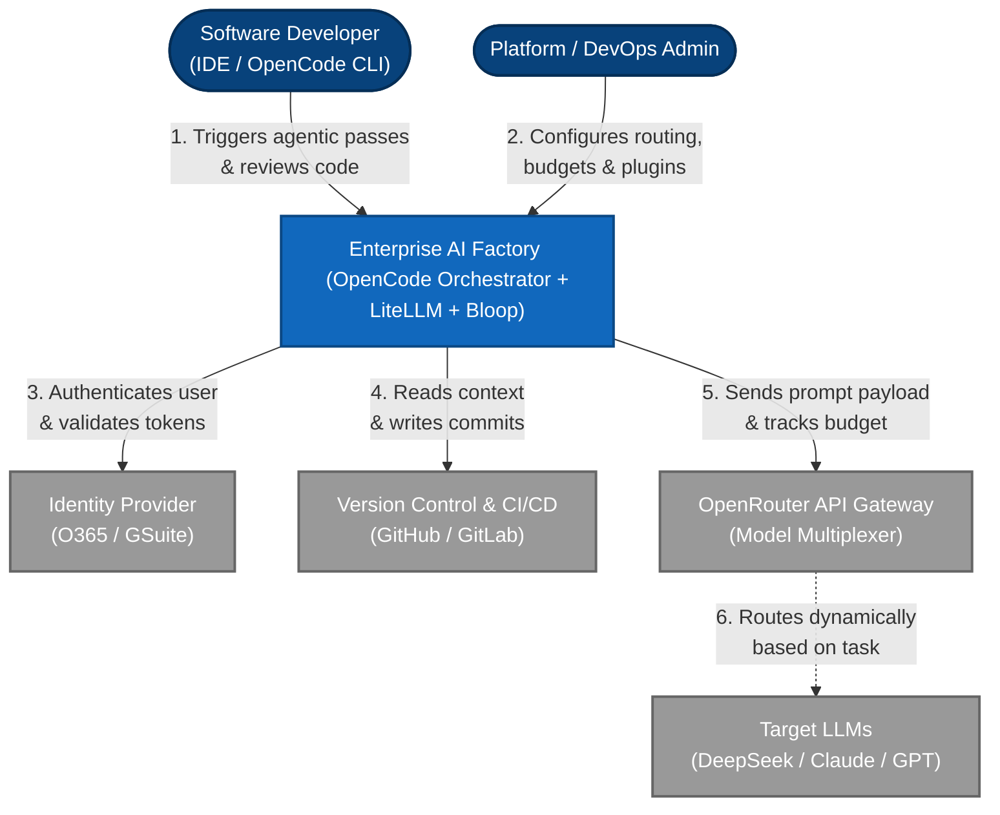

---

## 1. Background and Limitations

For the past two years, proprietary and open-source genAI coding tools have been evolving rapidly. They have been evolving faster than the developer community has been able to keep up. While the tools have been getting increasingly powerful and feature rich, it has been difficult to harness this power for teams. There are many public and celebrated "Agents.md" files but they focus only on the Agents and not the engineering around the Agents. There is also the FOMO factor on whether we are missing some capabilities or not by not using the very latest and greatest tools.

This unstructured approach fails at the enterprise level for three reasons:
1. **Context Bloat:** Dumping massive files into an Agentic window burns millions of expensive tokens.
2. **Spaghetti Edits:** Asking a single model to write core logic, implement security, and format logging simultaneously leads to "attention degradation". The model will inevitably "lazy code" one of these constraints.
3. **Specification Drift:** The Agentic model changes the code, but the architectural documentation and requirements are left untouched, creating a legacy codebase on day one.

To solve this, we evolved the approach to agent development to: **AI as an Assembly Line.**

### 1.1 The Proposed Paradigm: The Multi-Pass Pipeline

Instead of a single zero-shot prompt, development is broken down into a strict, sequential pipeline. Each step (pass) is handled by a specialized sub-agent with a deeply constrained scope and strict guard-rails.

> **The Decision:** We use a 8-pass pipeline (Design -> Contracts -> Tests -> Core Logic -> Refactor -> Security -> Observability -> Documentation).
>
> **The Rationale:** By strictly scoping each pass, we eliminate attention degradation. A "Security Agent" tasked *only* with finding OWASP vulnerabilities in a pre-written file performs significantly better than a generalist agent trying to write logic and secure it at the same time. Furthermore, tight scoping allows us to route simpler tasks to cheaper models, drastically reducing API costs.

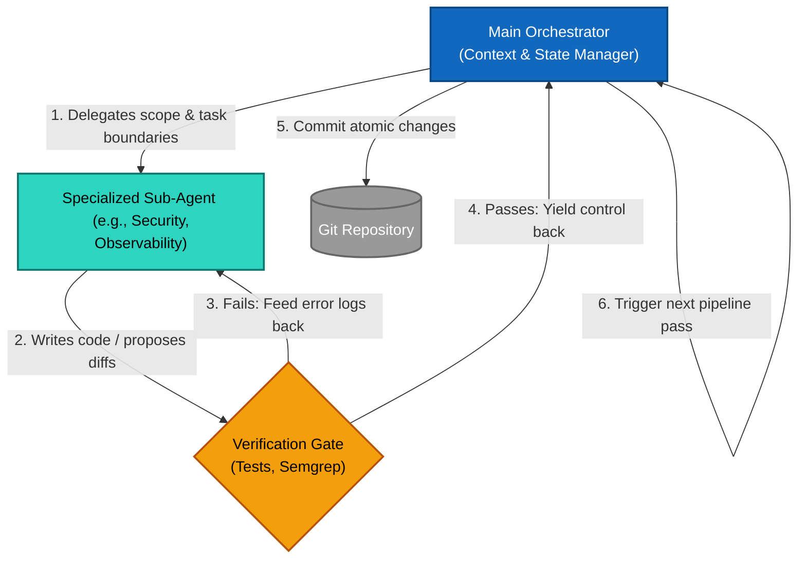

### 1.2 Core Tenet: Artifact-Driven Development

In traditional development, documentation is a markdown file written after the fact. In an AI-Native pipeline, **the artifacts are the source of truth, and the code is merely a byproduct.** AWS Kiro does a great job here but it has some constraints around model selection and customizability.

We rely on two core artifacts:
*   **`.mmd` (Mermaid.js):** Text-based sequence, state, and class diagrams.
*   **`.gherkin` (Behavior-Driven Specs):** Executable Given/When/Then requirements.

> **The Decision:** No agent is allowed to write core logic until a Mermaid diagram and a Gherkin specification have been generated, updated, and approved by a human. This Human-in-the-loop is our check against AI hallucination.
>
> **The Rationale:** LLMs are prone to "logical tangents" when writing code directly. Forcing the AI to map a state machine in Mermaid.js *first* enforces Architectural Chain-of-Thought. When the AI subsequently writes the code, it uses its own diagram as a strict mathematical constraint, virtually eliminating logical hallucinations. Diagrams are easier for humans to understand and follow, making it easier to catch unhandled scenarios and edge cases, thus reducing the cognitive load on the developer. This also helps in maintaining backward compatibility and ease of onboarding new developers.

(*Link to Traceability Matrix Diagram in Appendix.*)

### 1.3 Eliminating Specification Drift

The greatest risk of agentic coding (apart from the obvious hallucinations and questionable human oversight) is the speed at which it can outpace its own documentation.

> **The Decision:** We treat architectural diagrams and Gherkin specs as version-controlled, executable code. The pipeline enforces a mandatory "Artifact Sync" rule: an agent mandatorily updates the '.mmd' and '.gherkin' and takes human approval of these changes before touching any core logic. 
>
> **The Rationale:** This creates a "Digital Twin" of your software. By utilizing `JSDoc @see` links pointing directly to local `.mmd` files, human developers can instantly trace complex AI-generated code back to the exact state transition diagram that dictated it. Spec drift becomes impossible because the spec and the code are locked in a continuous feedback loop.

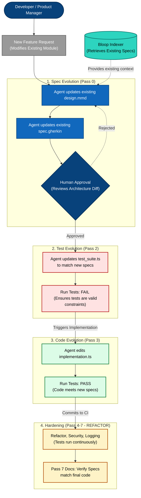

**The Reality Check: Why Diagrams Actually Reduce Costs**

The "Multi-Pass Pipeline" sounds expensive: multiple API calls, multiple context windows, human approval gates.

However, in practice, this system acts as a **Context Collapse Filter**. Consider the alternative: a "Zero-Shot" approach where a single agent writes the code directly from the initial ticket.

Without a visual constraint, the agent must hold the entire feature logic, plus the entirety of the existing codebase (e.g., the `Order` module), in its context window simultaneously. This inevitably leads to **Logical Dilution**, where the agent "lazy codes" constraints to save token space, resulting in bugs that require hours of debugging.

By forcing the creation of a Mermaid diagram first, we do the following:
1. **Token Compression:** A Mermaid diagram encoding 500 lines of logic uses 90% fewer tokens than the source code itself.
2. **Early Error Detection:** A human can spot a logical flaw in a 200-token diagram in seconds, preventing a 2,000-line buggy implementation that would take hours to refactor.
3. **Recursive Constraint:** The diagram becomes a persistent, cheap "Context Anchor" that can be re-fed to the agent in subsequent passes without blowing the budget.

---

## 2. The Architecture & Infrastructure

To execute an 8-pass agentic pipeline safely across hundreds of developers, the underlying infrastructure must enforce security, budget constraints, and context accuracy before a single prompt reaches an LLM. 

We achieve this by decoupling the agent from the LLM provider, utilizing a secure gateway proxy, and building a centralized semantic knowledge graph.

### 2.1 The Model Gateway: LiteLLM + OpenRouter + SSO

Relying on a single vendor (like GitHub Copilot or ChatGPT Enterprise) locks an organization into arbitrary pricing models, limits model choice, and removes granular auditing capabilities.

> **The Decision:** We route all agent traffic through a self-hosted [**LiteLLM**](https://github.com/BerriAI/litellm) (or [Bifrost](https://github.com/maximhq/bifrost)) proxy, authenticated via corporate SSO (O365/GSuite), which then multiplexes requests to **OpenRouter** (or internal models).
>
> **The Rationale:** 
> *   **Budget Rationing:** LiteLLM intercepts the SSO identity and checks it against the internal Postgres database. We can enforce hard monthly budgets per developer or per department. Once the budget is hit, the proxy returns a `402 Payment Required`, preventing runaway agent loops from causing massive API bills. (Optionally, We can also have a fallback option of cheaper/smaller models with some warning.)
> *   **Model Routing:** Pass 1 (Contracts) requires the strict formatting of Claude 3.7 (or higher), while Pass 3 (Core Logic) can be handled by the 80% cheaper DeepSeek v4 (or other models). The proxy allows us to dynamically route tasks to the most cost-effective model without changing the developer's local tools.
> *   **PII & Data Loss Prevention (DLP):** The proxy acts as a firewall. Middleware can strip sensitive API keys, DB credentials, or PII from the prompt before it ever leaves the corporate network.

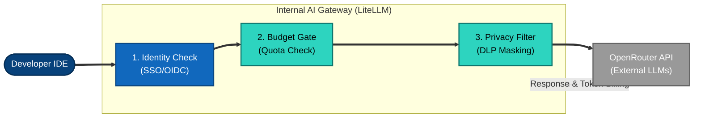
A more detailed diagram can be found in the Appendix (**Placeholder for link to Diagram**)

### 2.2 The Knowledge Layer: Bloop AI & Semantic Indexing

An AI agent is only as intelligent as the context it is given. Under-optimised agentic tools (including Gemini-cli, Claude-Code) attempt to solve this by context stuffing or inefficiently running `grep` across the terminal or asking the user to drag-and-drop files, which leads to massive token waste and missed cross-repository dependencies.

> **The Decision:** We deploy [**Bloop AI**](https://github.com/BloopAI/bloop) (or a similar vector/AST indexer like Zoekt) as an internal service to index all Git repositories, acting as the semantic search engine for the OpenCode orchestrator.
>
> **The Rationale:** When a developer asks an agent to "update the payment retry logic," the Pass 0 (Design) agent queries the Bloop API. Bloop returns the exact `.mmd` diagrams, TypeScript interfaces, and database schemas required from across multiple microservices. This surgically precise context window (hundreds of tokens instead of thousands) prevents hallucinations and ensures the agent adheres to existing architectural patterns.

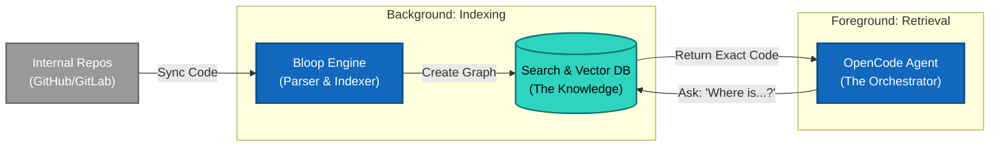
(Placeholder: Insert Link to detailed "Retrieval/Indexing Architecture Diagram" here)

### 2.3 Deterministic Environments (The Agent Sandbox)

Because our pipeline relies on a strict TDD methodology (Pass 2 tests *must* fail before Pass 3 writes code), the agents must be able to execute terminal commands like `npm test`, `mvn clean install`, or `pytest`. 

> **The Decision:** Agent execution is strictly bound to deterministic, containerized environments using **DevContainers (`devcontainer.json`)** or **Nix flakes**. (Implementation pending.)
>
> **The Rationale:** If an agent runs a test on a developer's local machine that has the wrong Node.js version, the test will fail due to environment errors. The agent will then hallucinate, attempting to rewrite perfectly good code to "fix" a problem that is actually an environment mismatch. By forcing agents to run in a sandboxed container, we guarantee reproducible builds, protect the host machine from rogue agent scripts, and ensure the TDD loop is cryptographically reliable.

---

## 3. The 8-Pass Pipeline & Model Strategy

The heart of the our OpenCode Enterprise Framework is the orchestrator script that transitions the agent through eight strictly scoped phases. By decomposing the software development lifecycle (SDLC) into granular agentic tasks, we can apply the "Actor-Critic" and "Red-Green-Refactor" methodologies programmatically.

```mermaid
---
title: 7-Pass Agentic TDD Pipeline (State Machine)
---
stateDiagram-v2
    %% Consistent Styling Definitions
    classDef human fill:#08427b,color:#fff,stroke:#052e56,stroke-width:2px
    classDef agent fill:#1168bd,color:#fff,stroke:#0b4884,stroke-width:2px
    classDef testGate fill:#2dd4bf,color:#000,stroke:#0f766e,stroke-width:2px

    [*] --> Pass_0
    
    %% --- PHASE 1: Design & Specs ---
    Pass_0 : Pass 0 - Design & Context (Agent)
    class Pass_0 agent
    
    HITL : Developer Review (HITL)
    class HITL human
    
    Pass_0 --> HITL : Outputs .mmd & .gherkin
    HITL --> Pass_0 : Request Architecture Changes
    HITL --> Pass_1 : Approve Specs
    
    %% --- PHASE 2: Contracts & Tests ---
    Pass_1 : Pass 1 - Contracts & Types (Agent)
    class Pass_1 agent
    
    Pass_2 : Pass 2 - Test Generation [Red Phase]
    class Pass_2 agent
    
    Pass_1 --> Pass_2
    Pass_2 --> Pass_3
    
    %% --- PHASE 3: Core Implementation ---
    Pass_3 : Pass 3 - Core Logic [Green Phase]
    class Pass_3 agent
    
    Gate_3 : Test Runner (Verify Core)
    class Gate_3 testGate
    
    Pass_3 --> Gate_3
    Gate_3 --> Pass_3 : Tests Failed (Fix Core)
    Gate_3 --> Pass_4 : Tests Passed
    
    %% --- PHASE 4: Refactor ---
    Pass_4 : Pass 4 - Clean Code & Refactor
    class Pass_4 agent
    
    Gate_4 : Test Runner (Verify Refactor)
    class Gate_4 testGate

    Pass_4 --> Gate_4
    Gate_4 --> Pass_4 : Refactor Broke Logic (Revert & Fix)
    Gate_4 --> Pass_5 : Tests Passed
    
    %% --- PHASE 5: Security ---
    Pass_5 : Pass 5 - Security Hardening
    class Pass_5 agent
    
    Gate_5 : Test Runner (Verify Security)
    class Gate_5 testGate
    
    Pass_5 --> Gate_5
    Gate_5 --> Pass_5 : Security Blocked Valid Logic (Fix)
    Gate_5 --> Pass_6 : Tests Passed
    
    %% --- PHASE 6: Observability ---
    Pass_6 : Pass 6 - Observability & Logs
    class Pass_6 agent
    
    Gate_6 : Test Runner (Verify Observability)
    class Gate_6 testGate
    
    Pass_6 --> Gate_6
    Gate_6 --> Pass_6 : Logs Broke Scopes/Types (Fix)
    Gate_6 --> Pass_7 : Tests Passed
    
    %% --- PHASE 7: Documentation & Spec Sync ---
    Pass_7 : Pass 7 - Sync Docs & Spec Artifacts
    class Pass_7 agent
    
    Gate_7 : Final CI/CD Verification
    class Gate_7 testGate
    
    Pass_7 --> Gate_7
    Gate_7 --> Pass_7 : Spec Drift Detected (Update Specs)
    Gate_7 --> [*] : Branch Ready for PR
```

### 3.1 The Pipeline Breakdown

The workflow requires the OpenCode orchestrator to sequentially trigger the following sub-agents:

1. **Pass 0: Design & Context** (The Architect)
   * *Goal:* Read the feature ticket, query Bloop for repository context, and generate/update the `design.mmd` (Mermaid diagrams) and `spec.gherkin`. 
   * *Gate:* Requires human (Developer) approval before proceeding.
2. **Pass 1: Contracts & Interfaces** (The Modeler)
   * *Goal:* Define the strict API boundaries, types, and data schemas (e.g., TypeScript Interfaces, Pydantic models).
3. **Pass 2: TDD Test Generation** (The QA Red Phase)
   * *Goal:* Write comprehensive unit and edge-case tests against the Pass 1 interfaces based purely on the Pass 0 diagrams. Do *not* write core logic.
4. **Pass 3: Core Implementation** (The Builder Green Phase)
   * *Goal:* Write the algorithmic logic to make the Pass 2 tests pass. 
   * *Gate:* `npm test` must pass. If it fails, the agent reads the error log and self-corrects.
5. **Pass 4: Refactor & Optimization** (The Optimizer)
   * *Goal:* Reduce cyclomatic complexity, enforce DRY principles, and optimize Big-O performance without changing behavior.
   * *Gate:* `npm test` must pass to ensure the refactor didn't break functionality.
6. **Pass 5: Security Hardening** (The Red Team)
   * *Goal:* Add input sanitization, OWASP mitigations, and boundary validation (e.g., Zod schemas). 
   * *Gate:* `npm test` must pass.
7. **Pass 6: Observability** (The SRE)
   * *Goal:* Implement uniform try/catch blocks, structured JSON logging, and custom error classes.
   * *Gate:* `npm test` must pass.
8. **Pass 7: Documentation** (The Tech Writer)
   * *Goal:* Generate JSDoc/Docstrings, sync the Traceability Matrix, and ensure the README and inline comments reflect the final implementation.

### 3.2 Dynamic Model Routing (The OpenRouter Strategy)

Using a frontier model (like Claude 4.x Sonnet or GPT-4.5) for all eight passes is financially irresponsible at an enterprise scale. Because we use LiteLLM and OpenRouter, we lock specific models to specific passes based on their training strengths.

> **The Decision:** We route Architectural passes to **Claude**, Logic/Execution passes to **DeepSeek**, Security passes to **OpenAI**, and text generation to **Llama/Gemini**. 
> 
>*(Given the bloop integration and resultant high-quality context, we think that 30B-300B param models too might do a great (or at least adequate) job for exeution passes 3-4 and 6,7. You should probably use a frontier model for the Security pass (pass 5) though.). Some more experiments with different models for different passes will be very helful.*
>
> **The Rationale:** 
> *   **Claude 3.7 Sonnet or higher (Passes 0 & 1):** Claude is the industry leader in Constitutional Adherence and Systems Design. It excels at reading messy Jira tickets and translating them into flawless XML and Mermaid.js boundaries without hallucinating premature code.
> *   **DeepSeek v4 (Passes 2, 3, & 4):** DeepSeek is an algorithmic powerhouse. For pure "make the tests pass" mathematical logic, it matches or beats proprietary frontier models at roughly 10% of the cost. It is our heavy-lifting engine.
> *   **GPT-4.5 (Pass 5 - Security):** OpenAI models undergo massive corporate RLHF (Reinforcement Learning from Human Feedback) for defensive cybersecurity. We pay the premium token cost here to leverage its deep red-teaming mindset to spot injection flaws.
> *   **Llama 3 70B / Gemini 2.5 Flash (Passes 6 & 7):** Adding logging and writing docstrings is highly repetitive, mundane prose. We route this to blazing-fast, nearly-free models to minimize overhead.

### 3.3 Execution: Atomic Commits vs. Bulk Edits

In a multi-pass system running locally, the compute overhead of testing is negligible, but the risk of "merge hell" is high.

> **The Decision:** The pipeline is orchestrated to pause, run the test suite, and execute an atomic `git commit` after *every individual pass* (starting from Pass 1), rather than squashing all AI edits into a single feature commit.
> *Example:* `git commit -m "chore(ai): applied security hardening"`
>
> **The Rationale:** If an agent outputs a massive single commit containing core logic, security updates, and new logs, and the application subsequently crashes, the developer has no idea which sub-agent broke the code. By testing and committing sequentially, a developer can pinpoint exactly which pass caused the regression and surgically `git revert` just that step, adjust the `agents.xml` prompt, and retry. This turns debugging an AI hallucination from a multi-hour headache into a 30-second revert.

---

## 4. Agent Guardrails & Prompt Engineering

Giving autonomous agents write-access to your codebase and API keys introduces massive risk. Without strict guardrails, an agent might accidentally overwrite business logic while trying to add a log statement, or fall victim to a "Prompt Injection" attack hidden in a legacy code comment.

To mitigate this, we define the agents' personas, constraints, and instructions using strict structural formatting within a centralized `.opencode/` directory in every repository.

### 4.1 XML Prompting over Markdown

Most agentic systems use Markdown (`# Instructions`, `## Context`) to prompt the LLM. For complex, multi-agent pipelines, Markdown is fundamentally flawed because it lacks strict boundaries. 

> **The Decision:** All sub-agent personas and system instructions must be formatted using strict XML tags (e.g., `<system_instructions>`, `<user_code>`, `<action_plan>`) rather than Markdown headers.
>
> **The Rationale:** If you use Markdown and feed the AI a codebase file that *also* contains Markdown comments, the LLM can easily confuse the code's comments for pipeline instructions (Prompt Injection). XML creates absolute semantic walls. The LLM understands that everything inside `<user_code> ... </user_code>` is purely a payload to be analyzed, not a command to be executed. This is Anthropic's recommended standard for zero-hallucination agent routing.

*Example of a secure `.opencode/agents.xml` definition:*
```xml
<agent>
  <role>Security Hardening Agent</role>
  <directives>
    <rule>Find and mitigate OWASP vulnerabilities.</rule>
    <rule>Do NOT modify the core algorithmic logic.</rule>
  </directives>
  <context>
    <!-- Injected by Bloop Retrieval -->
    {{COMPANY_SECURITY_PATTERNS}}
  </context>
  <task>
    Review the payload in the user_code tag. Output proposed fixes as Diffs.
  </task>
</agent>
```

### 4.2 Agent Isolation and Scope Locking

If the Observability Agent (Pass 6) decides that the core logic is "messy" and rewrites it while adding logs, the pipeline breaks. We must enforce the "Separation of Concerns" at the file and Abstract Syntax Tree (AST) level.

> **The Decision:** Agents are heavily restricted via "Scope Guardrails." If an agent believes an out-of-scope change is required (e.g., the Docs Agent realizes the Core Logic is flawed), it is forbidden from making the change. It must pause, delegate a request back to the Orchestrator, and wait for human intervention.
>
> **The Rationale:** This prevents "Agent Trampling." By enforcing strict write-locks based on the pipeline phase (e.g., Pass 2 can only write to `*.spec.ts`, Pass 7 can only edit comments/docstrings), we guarantee that downstream passes do not silently undo the verified work of upstream passes. 

### 4.3 Automated Hard-Fail Gates (Semgrep)

Even with the best models, we cannot trust AI-generated code blindly, especially concerning security and internal compliance.

> **The Decision:** The pipeline incorporates static analysis tools like **Semgrep** as automated "Hard-Fail" gates between passes.
>
> **The Rationale:** If the DeepSeek Core Logic agent (Pass 3) writes a working feature, but includes a hardcoded secret or a SQL injection vulnerability, Semgrep intercepts the code during the verification gate. Instead of passing the vulnerable code to the human, the pipeline automatically feeds the Semgrep error trace back to the agent for self-correction. The human never sees the code until it passes all deterministic static analysis checks.

---

## Next Steps and The Path Forward

By implementing the **Nistapp-OpenCode Enterprise Framework**, organizations stop paying for bloated token context windows and stop suffering from specification drift. Instead, developers become **System Orchestrators**—curating architecture via Mermaid diagrams, defining executable Gherkin specs, and reviewing atomic, verified Git commits generated by a highly disciplined, multi-pass AI pipeline.

This is a significant step towards a fundamentally safer, more maintainable way to build enterprise software.

## Apendix - 1 (Todo)
1. full text variable names vs. abbreviations
2. Others

---
## Apendix - 2 Detailed Diagrams
> 1. Logical Architecture (Network & Data Flow)
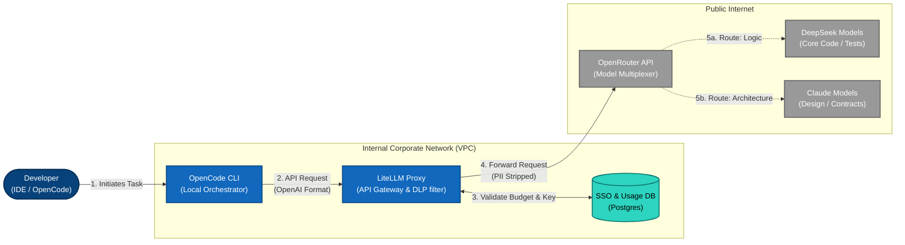

---
> 2. Component Deployment & Network Boundaries
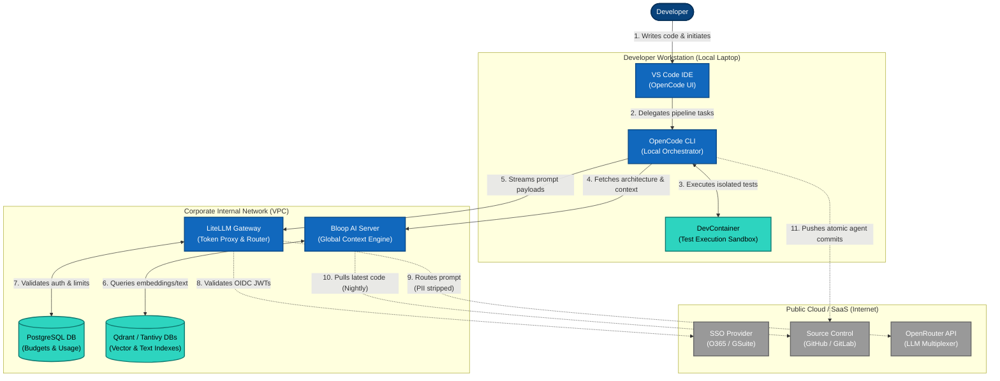

---
> 3. Pipeline Lifecycle
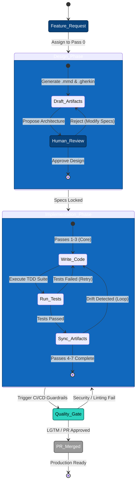

--- 
> 4. Git Lifecycle & Atomic Commits
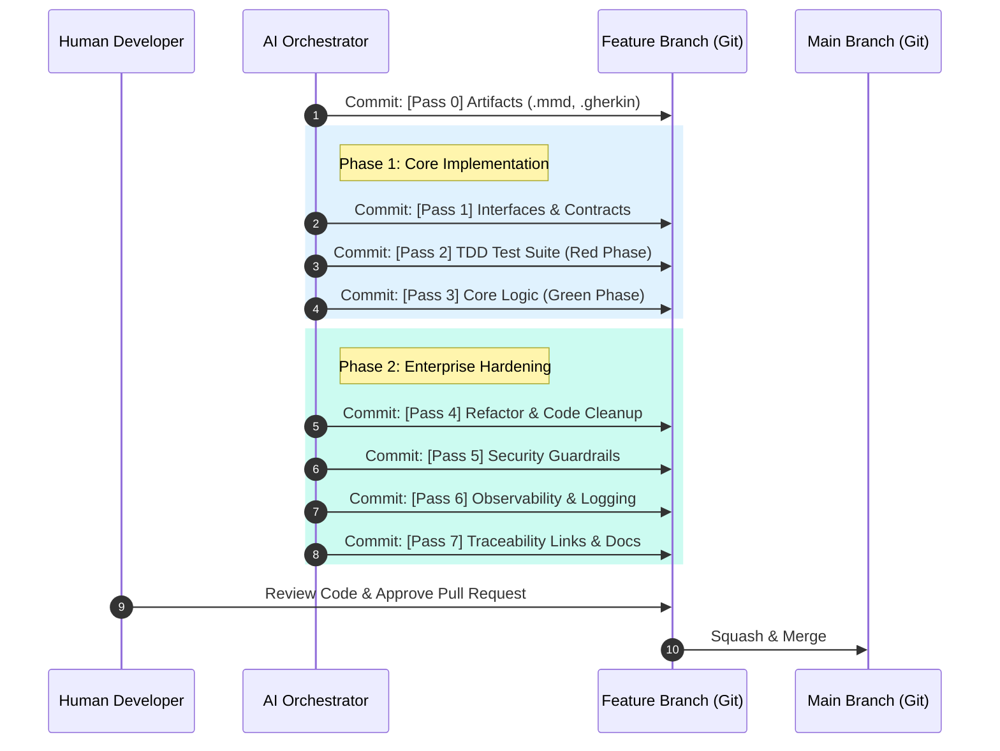
---
> 5. Retrieval & Indexing Architecture
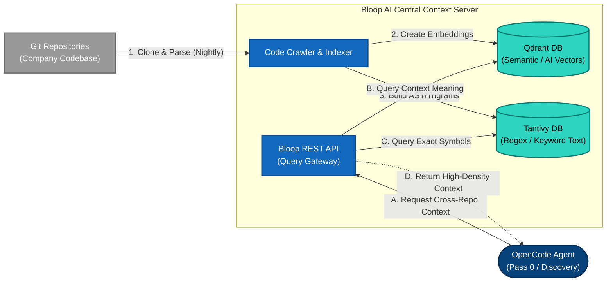

---
> 6. Knowledge Context Construction Flow
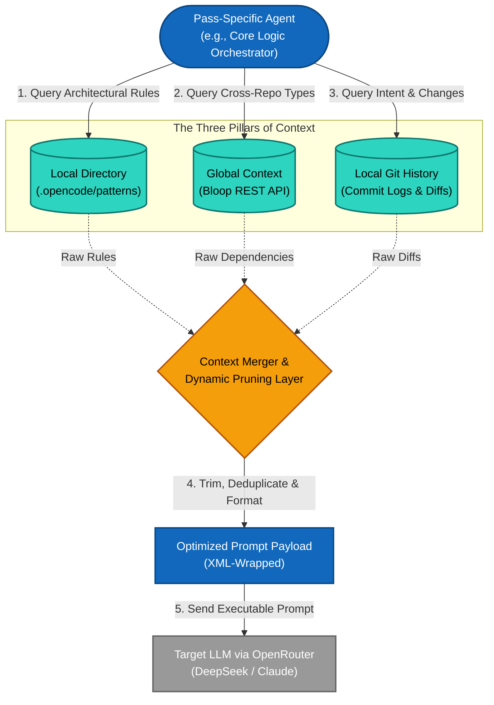

---
7. Auth and Budgeting
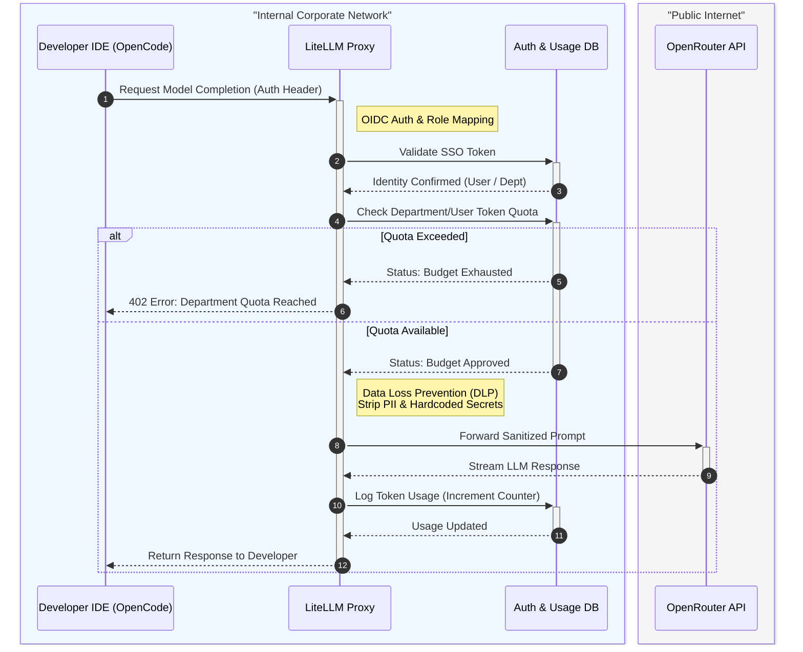

---
> 8. Security and PII
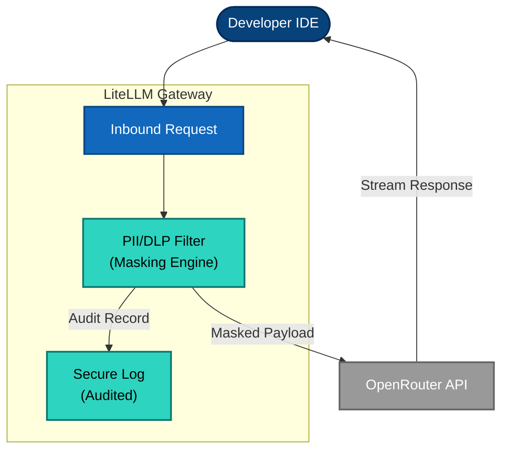

---
9. CI/CD PipeLine integration
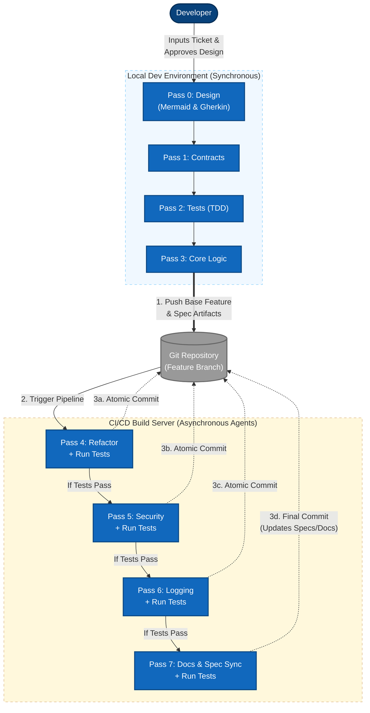

---
> 10. Developer aid: To help human developers understand and follow the code
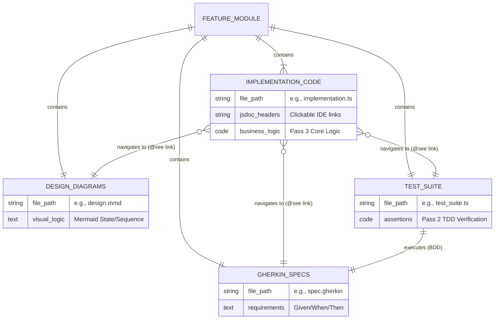

---