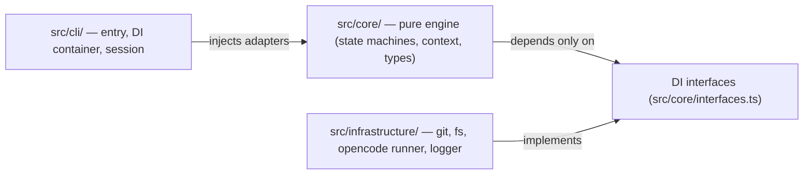
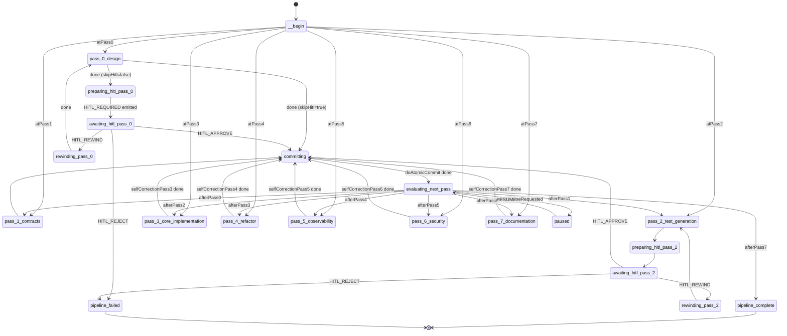
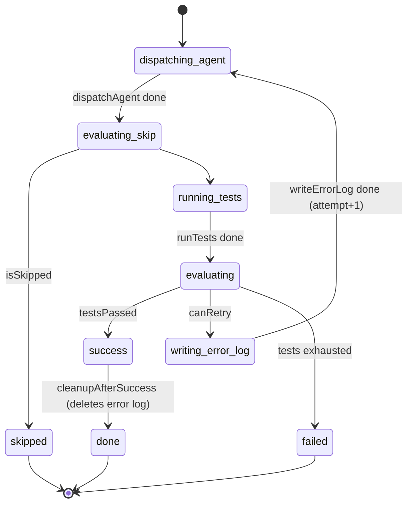

# 8. Core Engine Internals — Harness Engineering (XState)

> **Target Audience:** Contributors extending the pipeline.
> **Status:** DRAFT — grounded in the implemented state machines.
> **Prev:** [7. Security Model & Sandboxing](../user-overview/07-security-model.md) · **Next:** [2. Prompt Engineering](02-prompt-engineering.md)

---

## Overview

The orchestration harness is not a hand-rolled sequence of `if`/`while` loops — it is an **explicit XState state machine** in two layers:

- **`createPipelineMachine`** (`src/core/machines/pipeline.machine.ts`) — orchestrates the 8 passes, HITL gates, atomic commits, and pause/resume.
- **`createSelfCorrectionMachine`** (`src/core/machines/self-correction.machine.ts`) — the per-pass retry loop for guarded passes.

Both are **pure functions**: they perform no filesystem, git, or process I/O directly. Every side-effect flows through DI interfaces ([`src/core/interfaces.ts`](../../../src/core/interfaces.ts)) injected at construction time — see [ADR-0002](../adrs/0002-xstate-machines.md) and [ADR-0001](../adrs/0001-pure-core-engine.md).

> [!NOTE]
> There are two copies of the machine definition in each file: a module-level `pipelineMachineConfig` / `selfCorrectionMachineConfig` (Stately-visualisable, stubbed actors) and the real `create*Machine` factory that `.provide()`s the live actors. The rest of this page describes the real factory.

---

## The Host: `PipelineOrchestrator`

`PipelineOrchestrator` ([`src/core/orchestrator.ts#L22-L189`](../../../src/core/orchestrator.ts#L22-L189)) is the engine's entry point. Its [`run()`](../../../src/core/orchestrator.ts#L80-L188) method:

1. **Builds the machine** — wires the two XState machines with the injected services.
2. **Creates the actor** — resumes from a persisted `xstateSnapshot` when `--resume` is used, otherwise starts from the requested pass.
3. **Bridges the HITL gate** — subscribes to `HITL_REQUIRED` events and forwards the human decision (approve / rewind / reject) into the machine.
4. **Persists state** — saves the context and snapshot on completion or failure.

It is a **thin coordinator**: the actual orchestration logic lives in the state machines below; the orchestrator just hosts them. The engine's public surface is [`src/core/index.ts`](../../../src/core/index.ts) — `PipelineOrchestrator`, types, DI interfaces, and the machines.

## Engine Module Map

The machines are supported by these pure-core modules:

| Module | File | Role |
|---|---|---|
| **Context provider** | [`src/core/context-provider.ts`](../../../src/core/context-provider.ts) | Pure per-pass context assembly from session history. |
| **Context builder** | [`src/core/context-builder.ts`](../../../src/core/context-builder.ts) | Decides which files/symbols each pass sees (`CONTEXT_RULES`). |
| **Payload & artefacts** | [`src/core/runners/shared.ts`](../../../src/core/runners/shared.ts) | `getAgentContextPayload` / `buildArtefacts` — the JSON handed to each agent. |
| **Skip protocol** | [`src/core/skip-parser.ts`](../../../src/core/skip-parser.ts) | Parses `SKIP:N:reason` agent signals. |
| **Log sanitisation** | [`src/core/log-sanitizer.ts`](../../../src/core/log-sanitizer.ts) | Strips control chars / truncates before log emission. |
| **Contracts** | [`src/core/types.ts`](../../../src/core/types.ts) · [`src/core/interfaces.ts`](../../../src/core/interfaces.ts) | Pass sets, events, context shape, and the DI ports. |

Deep dives for the context/payload modules live on [3. Context Engineering](03-context-engineering.md).

---

## Boundaries

> [!IMPORTANT]
> The dependency arrows are **one-way**. `src/cli/` and `src/infrastructure/` may import `src/core/`, but `src/core/` must never import back. The engine never touches `NodeFileSystem`, `GitService`, or `OpenCodeAgentRunner` directly — it sees only `IFileSystem`, `IGitService`, and `IAgentRunner` ([ADR-0001](../adrs/0001-pure-core-engine.md)). See [5. CLI & DI Wiring](05-cli-di-wiring.md) for the full adapter wiring.

---

## 1. The Pipeline Machine

### 1.1 State Map

### 1.2 States & Actors

| State | Actor (`src`) | Purpose |
|---|---|---|
| `pass_0_design` | `runPass0` | Zeroes `design.mmd` + `spec.gherkin`, dispatches Pass 0, validates artefact length ≥ 30. |
| `pass_1_contracts`, `pass_2_test_generation` | `runSimplePass` | Dispatch agent, parse `SKIP` signal, collect pending git changes. |
| `pass_3…pass_7` | `selfCorrectionPass3…7` | Delegate to a Self-Correction Machine instance. |
| `preparing_hitl_pass_0/2`, `awaiting_hitl_pass_0/2` | `prepareHitl` | Collect pending files, emit `HITL_REQUIRED`, await `HITL_APPROVE` / `HITL_REWIND` / `HITL_REJECT`. |
| `rewinding_pass_0/2` | `rewindToPassStart` | `git abortToSha(targetSha)` + `resetWorkingTree()` then re-enter the pass. |
| `committing` | `doAtomicCommit` | Record outcome, stage `.` + state file, commit `chore(ai): completed Pass N -- …`, resolve `targetSymbols`/`fileChanges`. |
| `evaluating_next_pass` | — | Guard chain deciding next pass, pause, or completion. |
| `paused` | — | Await `RESUME`; `xstateSnapshot` persisted for `--resume`. |
| `pipeline_complete` / `pipeline_failed` | — | Final states. |

### 1.3 Events

Catalogue from [`src/core/types.ts#L216-L231`](../../../src/core/types.ts#L216-L231):

| Event | Meaning |
|---|---|
| `PIPELINE_STARTED` / `PIPELINE_COMPLETED` / `PIPELINE_PAUSED` / `PIPELINE_RESUMED` | Pipeline lifecycle |
| `PASS_STARTED` / `PASS_COMPLETED` | Per-pass lifecycle |
| `COMMIT_CAPTURED` | After `doAtomicCommit` resolves `files`, `targetSymbols`, `fileChanges` |
| `TEST_RUN_STARTED` / `TEST_RUN_COMPLETED` / `TEST_RUN_FAILED` | Emitted by the Self-Correction Machine's `runTests` actor |
| `SELF_CORRECTION_ATTEMPTED` | A retry cycle began (attempt 2+) |
| `HITL_REQUIRED` | Human gate requested with `{ files }` payload |
| `ERROR` | Fatal pipeline / pass error |

---

## 2. The Self-Correction Machine

Used for **guarded passes** — `SELF_CORRECTION_PASSES` = Passes 3, 4, 5, 6, 7 ([`src/core/types.ts#L52-L59`](../../../src/core/types.ts#L52-L59)).

### 2.1 The Loop

1. **`dispatchAgent`** — builds the context payload + artefacts; on attempts ≥ 2 attaches the error log via `buildArtefacts(ctx, fs, built, errorLog)` and sets `meta.attemptNumber`.
2. **`evaluating_skip`** — if output is `SKIP:N:reason`, transition to `skipped` without running tests.
3. **`running_tests`** — executes `ctx.testCmd` via `ICommandRunner.runTests`.
4. **`evaluating`** — passed → `success`; failed & `attempt < maxCorrectionRetries + 1` → write error log, retry; otherwise → `failed` (`emitTestsExhausted`).
5. **`cleanupAfterSuccess`** — deletes the pass error log (**Context Compaction**, [ADR-0005](../adrs/0005-context-compaction.md)) and emits `PASS_COMPLETED` with pending file changes.

Guards: `testsPassed`, `canRetry` (`attempt < maxCorrectionRetries + 1`), `isSkipped` (via `parseSkipSignal`).

> [!NOTE] Default retries
> `maxCorrectionRetries` is carried in `PipelineContext` (default `DEFAULT_MAX_CORRECTION_RETRIES = 3`); the guard yields `maxRetries + 1` total attempts — i.e. **up to 3 retries, 4 total attempts**.

---

## 3. Guards (pipeline)

All guards in [`src/core/machines/pipeline.machine.ts#L1134-L1187`](../../../src/core/machines/pipeline.machine.ts#L1134-L1187) are pure predicates over `context.ctx`:

- `atPass0…atPass7` — initial routing from `startPass`.
- `afterPass0…afterPass7` — next-pass routing from `evaluating_next_pass`.
- `skipHitl` — `ctx.skipHitl === true`.
- `isPauseRequested` — `ctx.pauseRequested === true`.

---

## 4. Atomic Commit & Symbol Capture (`doAtomicCommit`)

See [ADR-0003](../adrs/0003-atomic-commits-per-pass.md) for the rationale. Mechanics in [`pipeline.machine.ts#L871-L1012`](../../../src/core/machines/pipeline.machine.ts#L871-L1012):

1. Skip commit if pass not in `GIT_COMMIT_PASSES` or history marked skipped.
2. `recordPassOutcome(ctx, pass, 'completed', { filesTouched })`.
3. Stage `.` and the state file; commit `chore(ai): completed Pass N -- <label> - <featureName>`.
4. If `symbolResolver` present: `git diff --unified=0` from `resolveFromRef(ctx, pass)` to HEAD; map hunks to enclosing symbols via `ISymbolResolver.mapRangesToSymbols`; attach a **drift-resistant anchor** (`extractAnchor`) — 5 non-empty source lines at the hunk start.
5. Persist `targetSymbols` + `fileChanges` into `ctx.history[pass]` and the state store.

> [!NOTE] Non-fatal degradation
> If diff parsing, symbol resolution, or file reads fail, the pass still commits — errors are swallowed (`catch {}`) and the metadata is left empty (comment in source: "non-fatal degradation (AD-9)").

---

## 5. Pause / Resume

- `PAUSE` event (sent externally) sets `pauseRequested = true`; the machine completes the current pass+commit then parks in `paused`.
- `RESUME` returns to `evaluating_next_pass`.
- On every actor subscription, `PipelineOrchestrator.run` persists `actor.getPersistedSnapshot()` into `ctx.xstateSnapshot`. On `--resume`, `createActor(machine, { snapshot })` replays it exactly. See [`src/core/orchestrator.ts#L80-L188`](../../../src/core/orchestrator.ts#L80-L188).

---

## 6. Skip Signals

`parseSkipSignal` ([`src/core/skip-parser.ts`](../../../src/core/skip-parser.ts)) matches `^SKIP:(\d+):(.+)$`. Agents emit this line to declare a pass a no-op; the machine records `status: 'skipped'` + `skipReason` and skips tests/commit. Handled both in `runSimplePass` and the Self-Correction Machine's `evaluating_skip`.

---

## Related

- [ADR-0001 — Pure Core Engine](../adrs/0001-pure-core-engine.md)
- [ADR-0002 — XState Machines](../adrs/0002-xstate-machines.md)
- [ADR-0003 — Atomic Commits Per Pass](../adrs/0003-atomic-commits-per-pass.md)
- [ADR-0005 — Context Compaction](../adrs/0005-context-compaction.md)
- [3. Context Engineering](03-context-engineering.md) · [2. Prompt Engineering](02-prompt-engineering.md)
