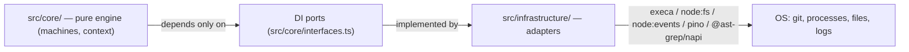

# 4. Infrastructure Adapters

> **Target Audience:** Contributors implementing or replacing DI adapters.
> **Status:** Published — grounded in `src/infrastructure/`.
> **Prev:** [3. Context Engineering](03-context-engineering.md) · **Next:** [5. CLI & Dependency Injection Wiring](05-cli-di-wiring.md)

---

## Overview

`src/infrastructure/` is the **only layer allowed to touch the OS**. Every process spawn, git call, file read, and log line flows through a concrete adapter here. The core engine never imports any of these classes — it depends exclusively on the abstract ports in [`src/core/interfaces.ts`](../../../src/core/interfaces.ts) (see [ADR-0001](../adrs/0001-pure-core-engine.md)).

There are **eight adapters**, each implementing one or more DI ports:

| Port (`interfaces.ts`) | Adapter | File |
|---|---|---|
| `IAgentRunner` | `OpenCodeAgentRunner` | [`open-code-agent-runner.ts`](../../../src/infrastructure/open-code-agent-runner.ts) |
| `IGitService` | `GitService` | [`git-service.ts`](../../../src/infrastructure/git-service.ts) |
| `ISymbolResolver` | `AstGrepSymbolResolver` | [`ast-grep-symbol-resolver.ts`](../../../src/infrastructure/ast-grep-symbol-resolver.ts) |
| `ICommandRunner` + `IOpencodeSpawner` | `CommandRunner` | [`command-runner.ts`](../../../src/infrastructure/command-runner.ts) |
| `IStateStore` | `JsonStateStore` | [`state-store.ts`](../../../src/infrastructure/state-store.ts) |
| `IFileSystem` | `NodeFileSystem` | [`file-system.ts`](../../../src/infrastructure/file-system.ts) |
| `IEventBus` | `EventBus` | [`event-bus.ts`](../../../src/infrastructure/event-bus.ts) |
| `ILogger` | `PinoLoggerAdapter` | [`pino-logger.ts`](../../../src/infrastructure/pino-logger.ts) |



> [!IMPORTANT]
> The dependency arrows are **one-way**. Adapters import types and interfaces from `src/core/`, never the reverse. A new OS-level capability is added as a port in `interfaces.ts`, an adapter in `src/infrastructure/`, and a registration in `src/cli/di-container.ts` ([5. CLI & DI Wiring §3](05-cli-di-wiring.md#3-the-di-contract)).

---

## 1. Port → Adapter Map (I-1)

| Port | Interface (`interfaces.ts`) | Adapter | Key methods | Construction |
|---|---|---|---|---|
| `IGitService` | [`#L19-L85`](../../../src/core/interfaces.ts#L19-L85) | `GitService` | `commit`, `getPendingChanges`, `getDiffLineRanges`, `createFeatureBranch`, `abortToSha`, `resetWorkingTree`, `getLastCompletedPass`, `tag` | Injected from `session.ts` (page 5) |
| `IFileSystem` | [`#L91-L112`](../../../src/core/interfaces.ts#L91-L112) | `NodeFileSystem` | `exists`, `readFile`, `writeFile`, `mkdir`, `deleteFile`, `renameFile`, `readdir` | Injected from `session.ts` (page 5) |
| `ICommandRunner` | [`#L118-L126`](../../../src/core/interfaces.ts#L118-L126) | `CommandRunner` | `runTests` | `new CommandRunner()` in `di-container.ts` |
| `IOpencodeSpawner` | [`#L150-L163`](../../../src/core/interfaces.ts#L150-L163) | `CommandRunner` | `spawn` | Same instance as `ICommandRunner` |
| `IAgentRunner` | [`#L132-L144`](../../../src/core/interfaces.ts#L132-L144) | `OpenCodeAgentRunner` | `execute` | [`di-container.ts#L53-L55`](../../../src/cli/di-container.ts#L53-L55) |
| `IStateStore` | [`#L185-L193`](../../../src/core/interfaces.ts#L185-L193) | `JsonStateStore` | `save`, `load`, `delete`, `exists`, `findActive` (static) | Injected from `session.ts` (page 5) |
| `IEventBus` | [`#L169-L179`](../../../src/core/interfaces.ts#L169-L179) | `EventBus` | `emit`, `on` | [`di-container.ts#L42`](../../../src/cli/di-container.ts#L42) |
| `ILogger` | [`#L199-L207`](../../../src/core/interfaces.ts#L199-L207) | `PinoLoggerAdapter` | `debug/info/warn/error`, `child`, `level` | [`di-container.ts#L54`](../../../src/cli/di-container.ts#L54) |
| `ISymbolResolver` | [`#L222-L237`](../../../src/core/interfaces.ts#L222-L237) | `AstGrepSymbolResolver` | `mapRangesToSymbols` | [`di-container.ts#L58`](../../../src/cli/di-container.ts#L58) (skipped with `--no-context-enrich`) |

Supporting constants live in `src/utils/`: state/log path helpers in [`paths.ts`](../../../src/utils/paths.ts), branch-name sanitisation in [`git-sanitize.ts`](../../../src/utils/git-sanitize.ts), and the pino root/child loggers in [`logger.ts`](../../../src/utils/logger.ts).

---

## 2. `OpenCodeAgentRunner` — the agent invocation seam

`OpenCodeAgentRunner` ([`open-code-agent-runner.ts#L11-L119`](../../../src/infrastructure/open-code-agent-runner.ts#L11-L119)) translates a high-level `AgentRunRequest` into a concrete `opencode run` argv and owns the per-pass output log.

### 2.1 Execution flow

[`execute()`](../../../src/infrastructure/open-code-agent-runner.ts#L29-L38) runs four steps:

1. **`#logPreFlight`** ([#L76-L99](../../../src/infrastructure/open-code-agent-runner.ts#L76-L99)) — logs the pass, agent name, the **effective** model (config value, else the agent file's frontmatter `model:`), its source (`config` | `frontmatter` | `none`), and API-key presence (`PipelineConfig.apiKeySet`) at `debug` level.
2. **`#buildArgs`** ([#L42-L74](../../../src/infrastructure/open-code-agent-runner.ts#L42-L74)) — assembles the argv (below), appending `--model <m>` when a model is configured for the pass.
3. **`#spawner.spawn(args)`** — delegates process lifecycle to the `IOpencodeSpawner` (the shared `CommandRunner`).
4. **`#persistPassLog`** ([#L101-L114](../../../src/infrastructure/open-code-agent-runner.ts#L101-L114)) — writes the combined output to `<workdir>/.agentic-tdd/log/pass-<pass>-<runId>.log` ([`getLogDir`](../../../src/utils/paths.ts#L24-L26)); failures only warn, never throw.

### 2.2 The argv contract

```text
opencode run
  --agent pass-N-*-agent
  [--file <designMmd>] [--file <specGherkin>] [--file <specFile>] [--file <errorLog>]
  [--print-logs --log-level DEBUG]      # only when ILogger.level is debug/trace
  [--model <provider/model>]            # effective model from config, when configured
  --dangerously-skip-permissions <prompt>
```

- Agent selection uses `AGENT_NAMES[pass]` ([`types.ts#L26-L35`](../../../src/core/types.ts#L26-L35)).
- `--file` attachments mirror `AgentArtefacts` ([`types.ts#L408-L414`](../../../src/core/types.ts#L408-L414)): the design Mermaid, Gherkin spec, the original feature spec, and — on self-correction retries — the error log. The prompt itself is the **positional** argument.
- `--print-logs` / `--log-level DEBUG` are injected only when the engine's log level is `debug`/`trace`, so noisy agent output doesn't leak by default.
- `--model` is appended when `PipelineConfig.models[AGENT_NAMES[pass]]` resolves (from `config.default.json` + `.agentic-tdd/config.json`; see [ADR-0009](../adrs/0009-configurable-per-agent-models.md)); otherwise opencode falls back to the agent file's frontmatter `model:`.

> [!NOTE] Guardrail interaction — verify
> The runner passes `--dangerously-skip-permissions`, which suppresses opencode's interactive permission prompts. The tool-level deny profile in each agent file (see [2. Prompt Engineering §2.2](02-prompt-engineering.md#22-permission-matrix)) is the shipped guardrail against **Agent Trampling**; whether `--dangerously-skip-permissions` weakens opencode's own permission system beyond the agent's `permission:` block is an open question (O-4 below) and should be verified against the opencode version in use.

---

## 3. `GitService` — atomic commits, diffs, and branch safety

`GitService` ([`git-service.ts#L96-L284`](../../../src/infrastructure/git-service.ts#L96-L284)) wraps the `git` CLI via `execa` and implements the full `IGitService` port.

### 3.1 Atomic commit & the nothing-to-commit contract

[`commit()`](../../../src/infrastructure/git-service.ts#L144-L174) `git add`s each file (collecting per-file failures into `addFailed`), then commits. It returns a discriminated `GitCommitResult` ([`types.ts#L287-L290`](../../../src/core/types.ts#L287-L290)):

- `committed` — the commit landed.
- `nothing_to_commit` — git refused (no changes / non-addable paths).
- `add_warning` — some files failed to stage but the commit still proceeded (or nothing left to commit).

The machine treats these gracefully instead of failing the pipeline.

### 3.2 Diff parsing for context enrichment

[`getDiffLineRanges()`](../../../src/infrastructure/git-service.ts#L99-L115) runs `git diff --unified=0 <fromRef> <toRef> --` and caches per `fromRef..toRef` in a private `#diffCache`. [`parseDiffUnified0`](../../../src/infrastructure/git-service.ts#L37-L94) is a hand-rolled unified-diff parser producing per-file, per-hunk `Range`s in the **new** file (1-based, inclusive) with a `ChangeKind` classification (`added` / `deleted` / `modified`, via `classifyHunk`). These become the `fileChanges` descriptors consumed by the next pass (see [3. Context Engineering §6](03-context-engineering.md#6-context-enrichment--anchored-change-descriptors)).

### 3.3 Session / rewind primitives

- `getLastCompletedPass()` ([#L181-L204](../../../src/infrastructure/git-service.ts#L181-L204)) — greps `git log --oneline --grep="chore(ai): completed Pass "` and returns the highest pass number; drives `--resume` fast-forwarding when no snapshot exists.
- `resetWorkingTree()` / `abortToSha()` ([#L206-L214](../../../src/infrastructure/git-service.ts#L206-L214)) — `git reset --hard` + `git clean -fd`; the rewind primitive for HITL rewind and `--abort`.

### 3.4 `createFeatureBranch` guard rails

[`createFeatureBranch()`](../../../src/infrastructure/git-service.ts#L220-L269) refuses to branch in unsafe situations:

| Outcome | Condition |
|---|---|
| `abort_dirty` | Working tree has uncommitted changes |
| `abort_main` | No `baseBranchOverride` and current branch is `main`/`master` |
| `abort_user_declined` | Target branch exists and user declines checkout (skipped when `skipHitl`) |
| `checked_out` / `created` | Branch exists / newly created |

The branch name is derived by [`sanitizeToGitBranch()`](../../../src/utils/git-sanitize.ts#L29-L63) (`"PAY-404"` → `feat/pay-404`, `"404"` → `ai/issue-404`). `#ensureBranchIsSynced` best-effort fetches the remote branch and swallows failures (e.g. no remote).

---

## 4. `AstGrepSymbolResolver` — diff hunks → enclosing symbols

`AstGrepSymbolResolver` ([`ast-grep-symbol-resolver.ts#L231-L255`](../../../src/infrastructure/ast-grep-symbol-resolver.ts#L231-L255)) maps line ranges to qualified symbol names **fully in memory** via `@ast-grep/napi` — no subprocess, no filesystem reads (see [ADR-0007](../adrs/0007-ast-grep-symbol-resolver.md)).

### 4.1 Algorithm

[`mapRangesToSymbols(filePath, source, ranges)`](../../../src/infrastructure/ast-grep-symbol-resolver.ts#L232-L254):

1. `detectLang(filePath)` from `EXTENSION_LANG` ([#L6-L13](../../../src/infrastructure/ast-grep-symbol-resolver.ts#L6-L13)) — `.ts/.tsx/.js/.jsx/.css/.html`. Unsupported extensions return `[]`.
2. `parse(lang, source)`; malformed source returns `[]` (never throws).
3. For each range, `findEnclosingSymbol` ([#L205-L225](../../../src/infrastructure/ast-grep-symbol-resolver.ts#L205-L225)) walks the AST depth-first to find the deepest enclosing function/method/class node (`ENCLOSING_KINDS`).
4. `buildQualifiedName` ([#L96-L138](../../../src/infrastructure/ast-grep-symbol-resolver.ts#L96-L138)) produces `ClassName.method`, and for test-style calls `describe('Foo') › it('edge case')` (`TEST_CALL_NAMES` = `describe`/`it`/`test`/`context`).
5. Results are deduplicated and sorted.

Note the 1-based (git diff) → 0-based (ast-grep) conversion at [#L247](../../../src/infrastructure/ast-grep-symbol-resolver.ts#L247).

### 4.2 Failure semantics

Ranges without an enclosing symbol are dropped; unsupported languages and parse errors return `[]`. In the pipeline this degradation is **non-fatal** — `doAtomicCommit` swallows errors and commits with empty metadata (see [1. Core Engine Internals §4](01-core-engine-internals.md#4-atomic-commit--symbol-capture-doatomiccommit)).

---

## 5. `CommandRunner` — test runner + opencode spawner (with watchdog)

`CommandRunner` ([`command-runner.ts#L27-L133`](../../../src/infrastructure/command-runner.ts#L27-L133)) is the **dual-purpose** adapter implementing both `ICommandRunner` and `IOpencodeSpawner`.

### 5.1 `runTests`

[`runTests(testCmd)`](../../../src/infrastructure/command-runner.ts#L28-L54) runs the user's test command with `reject: false`, capturing combined `stdout + stderr` into `TestRunResult { passed, output }`. The captured output feeds the self-correction loop's error log — it is intentionally not swallowed (per the `ICommandRunner` contract at [`interfaces.ts#L118-L126`](../../../src/core/interfaces.ts#L118-L126)).

### 5.2 `spawn` — process lifecycle

[`spawn(args)`](../../../src/infrastructure/command-runner.ts#L56-L132) launches `opencode` with `OPENCODE_CONFIG_DIR` pinned to the **package dir containing `agents/`** ([#L11-L12](../../../src/infrastructure/command-runner.ts#L11-L12)):

| Control | Constant | Value |
|---|---|---|
| Watchdog check interval | `OPENCODE_WATCHDOG_INTERVAL_MS` | 30 s |
| Idle heartbeat threshold | `OPENCODE_HEARTBEAT_THRESHOLD_MS` | 120 s |
| Hard timeout (kills `SIGKILL`) | `OPENCODE_HARD_TIMEOUT_MS` | 10 min |

Streamed `stdout`/`stderr` chunks update `lastActivity`; the watchdog only warns on silence, while the hard timeout forcibly kills a hung process. Diagnostics point at opencode's own log at `OPENCODE_LOG_PATH` (`~/.local/share/opencode/log/opencode.log`). Non-zero exits throw, propagating to the caller (the machine's `AGENT_FAILED` path).

> [!NOTE] Dev vs build agent dir
> `OPENCODE_CONFIG_DIR` is derived from the **compiled module path**: `dist/infrastructure` → `dist/agents` when built, `src/infrastructure` → `src/agents` under a source runner. If a contributor re-routes `npm link`/watch mode, verify `PACKAGE_AGENTS_DIR` resolves to the directory containing the freshly built agent files (see O-5).

---

## 6. `JsonStateStore` — session persistence

`JsonStateStore` ([`state-store.ts#L15-L113`](../../../src/infrastructure/state-store.ts#L15-L113)) persists `PipelineContext` + the XState snapshot to `<workdir>/.agentic-tdd/state-<feature>.json` ([`getStateFilePath`](../../../src/utils/paths.ts#L19-L22)).

### 6.1 Writes are atomic

[`save()`](../../../src/infrastructure/state-store.ts#L58-L67) writes `<path>.tmp` then `renameFile` into place, so a concurrent reader (or a crash) never observes a partially-written JSON file. The envelope is `{ schemaVersion, context }` ([`StateFileEnvelope`](../../../src/core/types.ts#L399-L402)), currently `0.2.0` with `0.1.0` still readable ([#L8-L11](../../../src/infrastructure/state-store.ts#L8-L11)).

### 6.2 Reads validate

[`load()`](../../../src/infrastructure/state-store.ts#L69-L104) rejects corrupt JSON and unsupported schema versions with descriptive errors; a bare context object (pre-envelope) is accepted via a forward-compat fallback.

### 6.3 `findActive` — the session lock

`JsonStateStore.findActive(fs, workDir)` ([#L26-L56](../../../src/infrastructure/state-store.ts#L26-L56)) scans `.agentic-tdd/state-*.json`:

- **Zero** files → `undefined` (fresh run).
- **One** file → returns a store bound to that session (`--resume` / `--abort`).
- **More than one** → **throws** listing all files and instructing the user to disambiguate with `--feature-desc-file`. This is the concurrency guard described in [5. CLI & DI Wiring §5](05-cli-di-wiring.md#5-session-lifecycle).

---

## 7. Thin adapters: `NodeFileSystem`, `EventBus`, `PinoLoggerAdapter`

- **`NodeFileSystem`** ([`file-system.ts#L6-L48`](../../../src/infrastructure/file-system.ts#L6-L48)) — thin promisified wrapper over `node:fs/promises`. `writeFile` auto-creates parent directories; `deleteFile` ignores missing files; `renameFile` supports the atomic state-store write.
- **`EventBus`** ([`event-bus.ts#L5-L17`](../../../src/infrastructure/event-bus.ts#L5-L17)) — a typed `node:events` wrapper. `emit(event)` dispatches on `event.kind`; `on(kind, handler)` returns an **unsubscribe** function. Decouples the engine from the terminal UI (event catalogue in [1. Core Engine Internals §1.3](01-core-engine-internals.md#13-events)).
- **`PinoLoggerAdapter`** ([`pino-logger.ts#L4-L34`](../../../src/infrastructure/pino-logger.ts#L4-L34)) — adapts a pino `Logger` to `ILogger`. `child(bindings)` creates a bound child (`logger.child({ module: 'agent-runner', pass })`). The `level` getter is the read-only switch that gates `--print-logs` injection in `OpenCodeAgentRunner`. Request-scoped logging (`reqLogger()`) is provided separately by [`utils/logger.ts`](../../../src/utils/logger.ts).

---

## 8. Lifecycle Edge Cases (I-2)

| Scenario | Behaviour | Where |
|---|---|---|
| **Concurrent session** | `findActive` throws on multiple state files; a second `start` fails until `--resume`/`--abort` | [`state-store.ts#L45-L51`](../../../src/infrastructure/state-store.ts#L45-L51) |
| **Crash mid-run** | `PipelineContext.xstateSnapshot` persisted after each pass; `--resume` replays it losslessly | `PipelineOrchestrator.run` ([1. Core Engine Internals §5](01-core-engine-internals.md#5-pause--resume)) |
| **Resume without snapshot** | `getLastCompletedPass` fast-forwards from the last committed pass | [`git-service.ts#L181-L204`](../../../src/infrastructure/git-service.ts#L181-L204) |
| **Corrupt / future schema state file** | `load` throws descriptive errors; pipeline refuses to resume blindly | [`state-store.ts#L69-L104`](../../../src/infrastructure/state-store.ts#L69-L104) |
| **Partial commit** | `commit` returns `nothing_to_commit` / `add_warning`; machine proceeds without a false failure | [`git-service.ts#L144-L174`](../../../src/infrastructure/git-service.ts#L144-L174) |
| **Dirty tree at branch time** | `createFeatureBranch` aborts (`abort_dirty`) before touching branches | [`git-service.ts#L226-L229`](../../../src/infrastructure/git-service.ts#L226-L229) |
| **Hung opencode process** | Watchdog warns on 120 s silence; 10-min hard timeout kills with `SIGKILL` | [`command-runner.ts#L80-L96`](../../../src/infrastructure/command-runner.ts#L80-L96) |
| **Context enrichment failure** | Diff parse / symbol resolution errors are swallowed; pass still commits with empty metadata | [1. Core Engine Internals §4](01-core-engine-internals.md#4-atomic-commit--symbol-capture-doatomiccommit) |

---

## Placeholders / Open Questions

| # | Topic | What is missing |
|---|---|---|
| O-4 | `--dangerously-skip-permissions` semantics | Whether it weakens the per-agent `permission:` block in opencode `run` — verify against the pinned opencode version; affects the guardrail claims in [2. Prompt Engineering §2.2](02-prompt-engineering.md#22-permission-matrix). |
| O-5 | `PACKAGE_AGENTS_DIR` resolution | Confirmed for `dist/` (built) and `src/` (source) layouts, but the dev-loop via `npm link`/watch mode is unverified — see §5.2. |
| O-6 | Session-lock recovery | `findActive` detects a stale state file left by a killed run but there is **no lock TTL or automatic expiry** — the operator must `--abort` manually. |

---

## Related

- [ADR-0001 — Pure Core Engine](../adrs/0001-pure-core-engine.md) · [ADR-0007 — AST-Grep Symbol Resolver](../adrs/0007-ast-grep-symbol-resolver.md)
- [5. CLI & Dependency Injection Wiring](05-cli-di-wiring.md) — where each adapter is constructed and injected
- [3. Context Engineering §6](03-context-engineering.md#6-context-enrichment--anchored-change-descriptors) — how `GitService` + `AstGrepSymbolResolver` feed `fileChanges`
- [2. Prompt Engineering §2](02-prompt-engineering.md#2-yaml-frontmatter--routing--permissions) — agent routing the runner consumes
