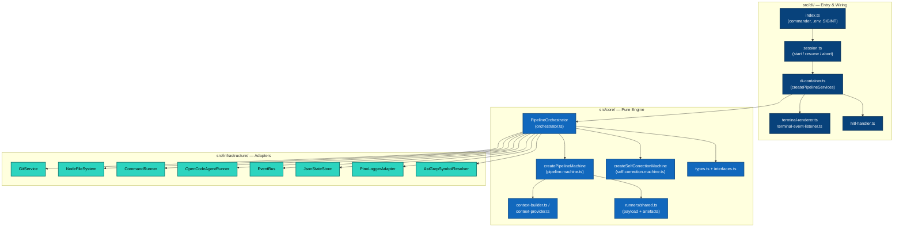
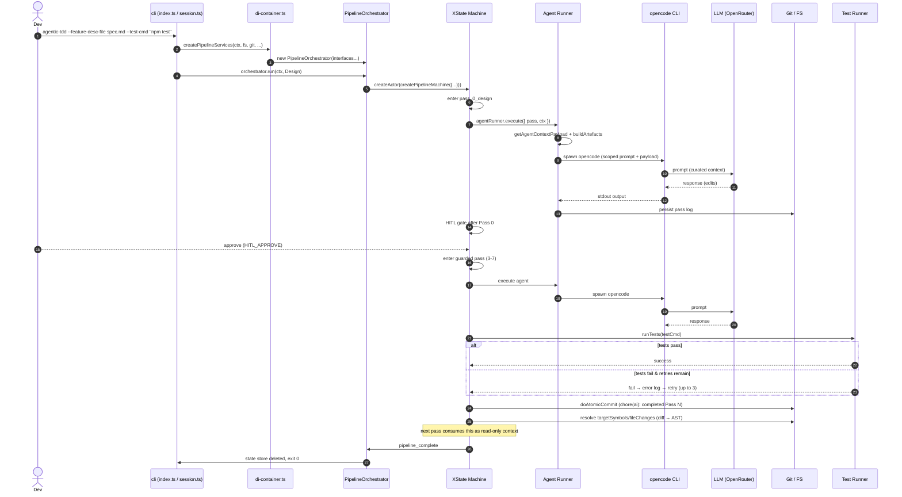

# 5. CLI & Dependency Injection Wiring

> **Target Audience:** Contributors touching entry points, DI, or the end-to-end wiring.
> **Status:** Published — component map + data flow grounded in `src/`; remaining outline items partially drafted.
> **Prev:** [4. Infrastructure Adapters](04-infrastructure-adapters.md) · **Next:** [6. Observability, Logging, & Operations](06-observability-operations.md)

---

## Overview

This page is the **C4 Level 2** companion to the user-facing [2. High-Level Architecture](../user-overview/02-high-level-architecture.md): the concrete component map, the Dependency Injection contract, and the end-to-end data flow. Where the user page answers *"what is this?"*, this page answers *"which file wires which, and in what order?"*

---

## 1. Component Map (C4 Level 2)

> [!IMPORTANT]
> **Dependency direction is one-way.** `src/cli/` and `src/infrastructure/` may import `src/core/`, but `src/core/` must never import back ([ADR-0001 — Pure Core Engine](../adrs/0001-pure-core-engine.md)). The arrows above follow the *actual injection* — every infra component is handed to the orchestrator as an interface, never imported.

---

## 2. Component responsibilities

| Component | File | Responsibility |
|---|---|---|
| **CLI entry** | [`src/cli/index.ts`](../../../src/cli/index.ts) | Parses CLI flags (commander), loads `.env`, installs SIGINT pause handling, dispatches to session. |
| **Session lifecycle** | [`src/cli/session.ts`](../../../src/cli/session.ts) | `startNewSession` / `resumeSession` / `abortSession`; creates feature branch, saves baseline SHA, computes artefact paths. |
| **DI container** | [`src/cli/di-container.ts#L39-L65`](../../../src/cli/di-container.ts#L39-L65) | `createPipelineServices` — wires EventBus, CommandRunner, AgentRunner, HitlHandler, SymbolResolver, StateStore into a `PipelineOrchestrator`. |
| **PipelineOrchestrator** | [`src/core/orchestrator.ts#L22-L188`](../../../src/core/orchestrator.ts#L22-L188) | Thin DI wrapper over the XState actor: creates the machine, resumes from `xstateSnapshot`, bridges HITL events, persists state. |
| **Pipeline machine** | [`src/core/machines/pipeline.machine.ts`](../../../src/core/machines/pipeline.machine.ts) | XState v5 machine orchestrating the 8 passes, HITL gates, atomic commits, pause/resume. |
| **Self-correction machine** | [`src/core/machines/self-correction.machine.ts`](../../../src/core/machines/self-correction.machine.ts) | Per-pass retry loop (up to 3 retries) feeding failing test logs back to the agent. |
| **Context builder/provider** | [`src/core/context-builder.ts`](../../../src/core/context-builder.ts), [`src/core/context-provider.ts`](../../../src/core/context-provider.ts) | Decides which files/symbols each pass sees (`CONTEXT_RULES`). |
| **Payload & artefacts** | [`src/core/runners/shared.ts`](../../../src/core/runners/shared.ts) | `getAgentContextPayload`, `buildArtefacts` — assembles the JSON context + anchored `fileChanges`/`targetSymbols`. |
| **Agent runner** | [`src/infrastructure/open-code-agent-runner.ts`](../../../src/infrastructure/open-code-agent-runner.ts) | Builds opencode argv from a pass + payload, spawns it, persists the pass log. |
| **Git service** | [`src/infrastructure/git-service.ts`](../../../src/infrastructure/git-service.ts) | Atomic commits, diff line ranges, branch creation, abort/rewind. |
| **Symbol resolver** | [`src/infrastructure/ast-grep-symbol-resolver.ts`](../../../src/infrastructure/ast-grep-symbol-resolver.ts) | Maps git-diff hunks to enclosing AST symbols for context enrichment. |
| **Event bus** | [`src/infrastructure/event-bus.ts`](../../../src/infrastructure/event-bus.ts) | Typed pub/sub decoupling the terminal UI from the engine. |
| **State store** | [`src/infrastructure/state-store.ts`](../../../src/infrastructure/state-store.ts) | Persists `PipelineContext` + `xstateSnapshot` for `--resume`. |

---

## 3. The DI contract

The engine depends **only** on interfaces declared in [`src/core/interfaces.ts`](../../../src/core/interfaces.ts):

| Interface | Backed by | Purpose |
|---|---|---|
| `IGitService` | `GitService` | git operations (commit, diff, branch, reset) |
| `IFileSystem` | `NodeFileSystem` | file read/write/exists |
| `ICommandRunner` | `CommandRunner` | run the test command; also `IOpencodeSpawner` |
| `IAgentRunner` | `OpenCodeAgentRunner` | execute a pipeline pass's agent |
| `IOpencodeSpawner` | `CommandRunner` | low-level process spawn + watchdog |
| `IEventBus` | `EventBus` | emit/subscribe to typed events |
| `IStateStore` | `JsonStateStore` | session persistence |
| `ILogger` | `PinoLoggerAdapter` | structured logging |
| `ISymbolResolver` | `AstGrepSymbolResolver` | diff → AST symbol mapping |
| `IContextProvider` | `StateContextProvider` | pure per-pass context assembly |

Wiring happens in one place — [`createPipelineServices`](../../../src/cli/di-container.ts#L39-L65):

1. A single `EventBus` is created and subscribed to by `attachTerminalListener` (progress rendering).
2. `CommandRunner` (test runner + opencode spawner), the HITL handler, and `OpenCodeAgentRunner` are constructed.
3. `PipelineConfig` is assembled via `buildPipelineConfig` from `getOpencodeLogPath()`, the presence of a model-provider API key (`OPENROUTER_API_KEY` or `DEEPSEEK_API_KEY`), and the resolved per-agent model config ([`resolveModelConfig`](../../../src/cli/model-config.ts), [ADR-0009](../adrs/0009-configurable-per-agent-models.md)).
4. All of it — plus `StateContextProvider`, the optional `AstGrepSymbolResolver`, and `JsonStateStore` — is passed to the `PipelineOrchestrator` constructor as interfaces.

> [!NOTE] Where to add a new adapter
> Add the port to [`src/core/interfaces.ts`](../../../src/core/interfaces.ts), implement it in `src/infrastructure/`, then register it in [`di-container.ts`](../../../src/cli/di-container.ts). Never import the concrete class from `src/core/`.

---

## 4. End-to-End Data Flow

### Walkthrough

1. **CLI parsing & env** — [`src/cli/index.ts`](../../../src/cli/index.ts) parses flags, loads `.env`, validates that a model-provider API key is set (`OPENROUTER_API_KEY` or `DEEPSEEK_API_KEY`).
2. **Session bootstrap** — [`session.ts#startNewSession`](../../../src/cli/session.ts#L160-L250) creates a feature branch, records the baseline SHA (`originalBaseSha`), and persists a `PipelineContext` via the state store.
3. **DI wiring** — [`di-container.ts#createPipelineServices`](../../../src/cli/di-container.ts#L39-L65) constructs all concrete adapters and hands them to the `PipelineOrchestrator` **as interfaces**.
4. **Machine start** — [`PipelineOrchestrator.run`](../../../src/core/orchestrator.ts#L80-L188) builds `createPipelineMachine`, resumes from a persisted `xstateSnapshot` when `--resume`, and starts the actor.
5. **Per pass** — the machine dispatches the agent: payload is assembled (`getAgentContextPayload`), opencode is spawned, and its output is captured + logged.
6. **Guarded passes (3–7)** — output is verified against `--test-cmd`; failures feed the error log back via the self-correction loop (up to 3 retries).
7. **Atomic commit** — each pass commits independently (`chore(ai): completed Pass N …`), and the diff is mapped to symbols for the next pass's context.
8. **Completion** — on `pipeline_complete` the session ends and the state file is deleted.

> [!NOTE]
> Step 6 implements the main cost lever: **Context Compaction** (error logs deleted on pass success, [ADR-0005](../adrs/0005-context-compaction.md)). Static Prefix ([ADR-0006](../adrs/0006-context-control-optimisation.md)) is **deprecated / low priority** pending research — see [discussion #53](https://github.com/Nistapp/agentic-tdd/discussions/53). See [3. Context Engineering](03-context-engineering.md).

---

## 5. Session Lifecycle

| Command | Path | Behaviour |
|---|---|---|
| `start` | [`startNewSession`](../../../src/cli/session.ts#L160-L250) | Create feature branch, save baseline SHA, persist `PipelineContext`, run from Pass 0. |
| `--resume` | [`resumeSession`](../../../src/cli/session.ts#L61-L158) | Replay `xstateSnapshot`; or fast-forward from `getLastCompletedPass` when no snapshot. |
| `--abort` | [`abortSession`](../../../src/cli/session.ts#L40-L59) | `git abortToSha(originalBaseSha)` / `resetWorkingTree()`, then delete the state file. |

> [!NOTE] Session locking
> `JsonStateStore.findActive` / `exists` guard concurrent runs — a second `start` fails with "An active TDD session is in progress. Use --resume … or --abort …".

---

## Placeholders / Open Questions

| # | Topic | What is missing |
|---|---|---|
| D-2 | Flag → config mapping | `--feature-desc-file`, `--test-cmd`, `--skip-hitl`, `--resume`, `--abort`, `--log-level`, `--no-context-enrich` — exact `PipelineContext` field mapping. |
| D-3 | Terminal rendering detail | Row/state rendering decisions in `terminal-renderer.ts` (banner, git info, progress). |

---

## Related

- [2. High-Level Architecture (User)](../user-overview/02-high-level-architecture.md)
- [1. Core Engine Internals](01-core-engine-internals.md) — how the orchestrator consumes injected services
- [4. Infrastructure Adapters](04-infrastructure-adapters.md) — per-adapter deep dives
- ADRs: [0001 Pure Core Engine](../adrs/0001-pure-core-engine.md) · [0005 Context Compaction](../adrs/0005-context-compaction.md) · [0006 Static Prefix (deprecated)](../adrs/0006-context-control-optimisation.md)
