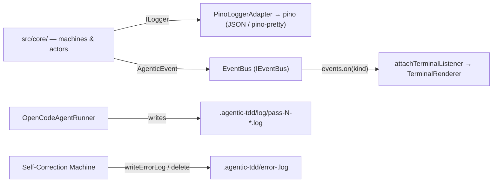

# 6. Observability, Logging, & Operations

> **Target Audience:** Contributors debugging passes or extending logging.
> **Status:** DRAFT — grounded in `src/core/log-sanitizer.ts`, `src/utils/logger.ts`, `src/infrastructure/`, and the CLI wiring.
> **Prev:** [5. CLI & Dependency Injection Wiring](05-cli-di-wiring.md) · **Next:** [7. Testing Strategy & Mock Patterns](07-testing-strategy.md)

---

## Overview

Observability is delivered through **two parallel channels**, both decoupled from the engine via DI:

1. **Structured JSON logs** (pino) — the machine-readable trail for debugging. Written by the engine through `ILogger` ([`interfaces.ts#L199-L207`](../../../src/core/interfaces.ts#L199-L207)), rooted at [`src/utils/logger.ts`](../../../src/utils/logger.ts), surfaced through the `PinoLoggerAdapter`.
2. **Typed domain events** (`IEventBus` → `AgenticEvent`) — the UI channel. The XState machines `emit()` lifecycle events; `attachTerminalListener` maps them to the `TerminalRenderer`.

Two on-disk artefacts round it out: per-pass **opencode output logs** and the transient **error log** that feeds self-correction retries.



---

## 1. Logging Architecture (pino)

### 1.1 Root, child, and request-scoped loggers

[`src/utils/logger.ts`](../../../src/utils/logger.ts) builds a single pino root named `orchestrator` and exposes:

| Export | Purpose |
|---|---|
| `loggers.cli` / `loggers.core` / `loggers.infra.*` | Static child loggers by module ([`logger.ts#L43-L59`](../../../src/utils/logger.ts#L43-L59)) |
| `loggers.agent(pass)` | Child logger bound to an agent name ([#L52-L58](../../../src/utils/logger.ts#L52-L58)) |
| `reqLogger()` | **Request-scoped** logger via `AsyncLocalStorage` ([#L37-L41](../../../src/utils/logger.ts#L37-L41)) — returns the storage-bound logger if a context was seeded, otherwise falls back to the **root** logger. Used by infra adapters (`CommandRunner`, `NodeFileSystem`). |

The engine never touches pino directly — it sees the `ILogger` port. [`PinoLoggerAdapter`](../../../src/infrastructure/pino-logger.ts#L4-L34) forwards `debug/info/warn/error` and `child(bindings)` (a new bound child), and its `level` getter exposes the active level.

> [!NOTE]
> The `AsyncLocalStorage` backing `reqLogger()` is declared but **never seeded** (`executionContextStorage.run` is not called anywhere), so today `reqLogger()` always resolves to the root logger. The run/pass context comes instead from explicit `child()` bindings (below) and from per-call `{ pass, runId }` fields in the infra loggers.

**Per-pass child loggers** — the pipeline machine builds a dedicated self-correction machine per guarded pass, each with its own child logger so every log line carries `passId`:

```
selfCorrectionPass3: createSelfCorrectionMachine({ … logger: logger.child({ passId: 3 }) … })
```

Wiring at [`pipeline.machine.ts#L1014-L1062`](../../../src/core/machines/pipeline.machine.ts#L1014-L1062). The agent runner similarly binds `module: 'agent-runner', pass, agent` ([`open-code-agent-runner.ts#L31`](../../../src/infrastructure/open-code-agent-runner.ts#L31)).

### 1.2 Level selection

Active level resolution ([`logger.ts#L6-L33`](../../../src/utils/logger.ts#L6-L33)), highest precedence first:

1. `--log-level <level>` CLI flag (`DEBUG | INFO | WARNING | ERROR`, default `INFO`) — [`index.ts#L74`](../../../src/cli/index.ts#L74).
2. `LOG_LEVEL` environment variable.
3. `DEBUG` env variable presence.

When debug is active, the transport switches to **pino-pretty** (colorized, human-readable terminal output) ([#L24-L33](../../../src/utils/logger.ts#L24-L33)); otherwise logs are plain JSON. The `ILogger.level` getter is the switch that makes `OpenCodeAgentRunner` inject `--print-logs --log-level DEBUG` into the opencode argv (see [4. Infrastructure Adapters §2.2](04-infrastructure-adapters.md#22-the-argv-contract)).

> [!NOTE]
> `PipelineContext.logLevel` is also carried through validation ([`validators.ts#L69`](../../../src/cli/validators.ts#L69)) and persisted, but the **effective** pino level is computed once at module load from `process.argv`/env. These two can diverge if `LOG_LEVEL` is set without `--log-level` (see O-5).

### 1.3 Log level semantics (resolves O-1)

| Level | Used for | Examples |
|---|---|---|
| `error` | Fatal/failing conditions | Test exhaustion after retries (`emitTestsExhausted`); agent/test/error-log actor failures (`emitAgentError`); opencode invocation failed ([`command-runner.ts#L120-L130`](../../../src/infrastructure/command-runner.ts#L120-L130)); CLI `uncaughtException`/`unhandledRejection` ([`index.ts#L20-L28`](../../../src/cli/index.ts#L20-L28)) |
| `warn` | Non-fatal degradations | Corrupt `xstateSnapshot` fallback ([`orchestrator.ts#L117-L122`](../../../src/core/orchestrator.ts#L117-L122)); implicit skip when a pass changed nothing ([`pipeline.machine.ts#L893`](../../../src/core/machines/pipeline.machine.ts#L893)); opencode watchdog idle ([`command-runner.ts#L83-L87`](../../../src/infrastructure/command-runner.ts#L83-L87)); failed pass-log persist / unreadable agent model ([`open-code-agent-runner.ts#L83`](../../../src/infrastructure/open-code-agent-runner.ts#L83)) |
| `info` | Pass lifecycle | `Entering Pass N [Attempt M]` ([`pipeline.machine.ts#L767`](../../../src/core/machines/pipeline.machine.ts#L767), [`self-correction.machine.ts#L366`](../../../src/core/machines/self-correction.machine.ts#L366)); skip signals ([`pipeline.machine.ts#L827`](../../../src/core/machines/pipeline.machine.ts#L827)); `PIPELINE_STARTED` |
| `debug` | Diagnostics | Sanitized prompt payload ([`pipeline.machine.ts#L770-L773`](../../../src/core/machines/pipeline.machine.ts#L770-L773)); opencode spawn + streamed chunks ([`command-runner.ts#L59-L68`](../../../src/infrastructure/command-runner.ts#L59-L68)); git/fs/cmd infra events |
| `trace` | Finest detail | File reads ([`file-system.ts#L17`](../../../src/infrastructure/file-system.ts#L17)) |

---

## 2. Pass Log Persistence

### 2.1 Per-pass opencode output

After every agent run, `OpenCodeAgentRunner.#persistPassLog` ([`open-code-agent-runner.ts#L93-L106`](../../../src/infrastructure/open-code-agent-runner.ts#L93-L106)) writes the combined stdout+stderr to:

```text
<workdir>/.agentic-tdd/log/pass-<pass>-<runId>.log      # getLogDir(), paths.ts#L24-L26
```

The directory is created on demand; failures only `warn`, never throw. These files are the raw, unsanitized agent transcript for post-mortem review.

### 2.2 Error log & Context Compaction

The **error log** lives at `<workdir>/.agentic-tdd/error-<feature>.log` ([`getErrorLogPath`](../../../src/utils/paths.ts#L28-L31)) and is managed by the Self-Correction Machine:

1. On a failed test run, the `writeErrorLog` actor persists the combined test output ([`self-correction.machine.ts#L420-L424`](../../../src/core/machines/self-correction.machine.ts#L420-L424)).
2. On retries, `buildArtefacts(ctx, fs, built, ctx.errorLogPath)` attaches it as an opencode `--file`, so the agent can diagnose the failure (see [3. Context Engineering §3.2](03-context-engineering.md#32-buildartefacts)).
3. On pass success, `cleanupAfterSuccess` **deletes** it ([#L433-L435](../../../src/core/machines/self-correction.machine.ts#L433-L435)) — **Context Compaction** ([ADR-0005](../adrs/0005-context-compaction.md)): later passes start clean instead of inheriting stale failure noise.

`PipelineOrchestrator.run` also deletes any stale error log at session start ([`orchestrator.ts#L84-L86`](../../../src/core/orchestrator.ts#L84-L86)).

> [!CAUTION]
> There is **no retention or rotation** for `.agentic-tdd/log/pass-*.log` — they accumulate for the life of the workspace (see O-3). Only the error log is lifecycle-managed.

---

## 3. Log Sanitizer (resolves O-2)

[`src/core/log-sanitizer.ts`](../../../src/core/log-sanitizer.ts) is a **pure core** utility that pre-processes log payloads:

| Rule | Detail |
|---|---|
| **C0 control-char strip** | Removes `\x00-\x08 \x0B \x0C \x0E-\x1F` ([#L2](../../../src/core/log-sanitizer.ts#L2)) — prevents terminal/log-injection via embedded control codes |
| **Length truncation** | Strings longer than **400 chars** are truncated with a `[Truncated: N characters total]` suffix ([#L1](../../../src/core/log-sanitizer.ts#L1), [#L4-L9](../../../src/core/log-sanitizer.ts#L4-L9)) |
| **Level-aware** | Truncation applies at `info` and above; at `debug`/`trace` strings pass through untouched ([#L6-L7](../../../src/core/log-sanitizer.ts#L6-L7)) |
| **Recursive** | Traverses arrays and plain objects, sanitizing every string value ([#L11-L23](../../../src/core/log-sanitizer.ts#L11-L23)) |

**Where it is applied:** agent prompts before they enter the `debug` log payload — `sanitizeLogPayload(prompt, 'info')` in the pipeline machine ([#L770-L773](../../../src/core/machines/pipeline.machine.ts#L770-L773), [#L811-L814](../../../src/core/machines/pipeline.machine.ts#L811-L814)) and the self-correction machine ([#L367-L369](../../../src/core/machines/self-correction.machine.ts#L367-L369)). Prompts can be huge JSON payloads; sanitizing them keeps the debug trail readable and blocks control-char injection.

> [!NOTE]
> The sanitizer strips control characters and truncates — it does **not** redact secrets or PII. Raw agent output is still persisted verbatim in `.agentic-tdd/log/`. Whether a redaction layer is needed (beyond the security pass's review of `logger.error` calls — [ADR-0008](../adrs/0008-observability-before-security.md)) is tracked as O-4.

---

## 4. Event Bus & Terminal UI

### 4.1 Emission flow

Both machines share the same `makeEmit(events)` helper ([`pipeline.machine.ts#L47-L63`](../../../src/core/machines/pipeline.machine.ts#L47-L63), [`self-correction.machine.ts#L33-L49`](../../../src/core/machines/self-correction.machine.ts#L33-L49)) which wraps an `AgenticEvent` (kind, message, timestamp, `pass`, `passLabel`, payload) and pushes it to `EventBus.emit`. `EventBus` ([`event-bus.ts#L5-L17`](../../../src/infrastructure/event-bus.ts#L5-L17)) dispatches on `event.kind` and returns an unsubscribe handle from `on`.

`attachTerminalListener` ([`terminal-event-listener.ts#L8-L75`](../../../src/cli/terminal-event-listener.ts#L8-L75)) is wired once in `createPipelineServices` ([`di-container.ts#L42-L43`](../../../src/cli/di-container.ts#L42-L43)) and maps every event kind to a `TerminalRenderer` method.

### 4.2 Event → renderer map

| Event kind | Emitted from | Rendered via (`terminal-event-listener.ts`) |
|---|---|---|
| `PIPELINE_STARTED` | `emitPipelineStarted` ([`pipeline.machine.ts#L1066-L1076`](../../../src/core/machines/pipeline.machine.ts#L1066-L1076)) | `loggers.core.info` only |
| `PASS_STARTED` | `runPass0` / `runSimplePass` / dispatch agent | `passHeader` (banner with pass label + agent name) |
| `PASS_COMPLETED` | `doAtomicCommit` path / `cleanupAfterSuccess` | `passOk` + `logChangedFiles` / `logNoChanges` / `logAttemptCount` |
| `COMMIT_CAPTURED` | `doAtomicCommit` ([#L1001-L1006](../../../src/core/machines/pipeline.machine.ts#L1001-L1006)) | `logCapturedContext` (symbol/hunk summary) |
| `TEST_RUN_STARTED` / `COMPLETED` / `FAILED` | self-correction `runTests` actor | `logTestStatus` |
| `SELF_CORRECTION_ATTEMPTED` | dispatch agent retry branch ([#L348-L353](../../../src/core/machines/self-correction.machine.ts#L348-L353)) | `logCompaction` |
| `WARNING` / `ERROR` | `emitPipelineError` / `emitAgentError` / `emitTestsExhausted` | `logWarnMessage` / `logErrorMessage` |
| `HITL_REQUIRED` | `emitHitlRequired` ([#L1097-L1107](../../../src/core/machines/pipeline.machine.ts#L1097-L1107)) | bridged to the readline handler (below), not rendered |
| `PIPELINE_PAUSED` / `RESUMED` | pause/resume actions | `pausedBanner` / `resumedBanner` |
| `PIPELINE_COMPLETED` | `emitPipelineCompleted` | `logPipelineComplete` |

### 4.3 HITL — the interactive gate

`HITL_REQUIRED` is **not** rendered — `PipelineOrchestrator.run` subscribes to it and forwards the human decision into the machine ([`orchestrator.ts#L137-L150`](../../../src/core/orchestrator.ts#L137-L150)):

1. `HITL_REQUIRED { files }` → `this.#onHitl(pass, files)`.
2. The injected handler `createHitlHandler` ([`hitl-handler.ts#L13-L26`](../../../src/cli/hitl-handler.ts#L13-L26)) renders a boxed prompt listing the artefacts (Pass 0) or generated test files (Pass 2).
3. Readline input maps to `HITL_APPROVE` / `HITL_REWIND` / `HITL_REJECT` via `HITL_EVENT_MAP` ([#L16-L20](../../../src/core/orchestrator.ts#L16-L20)).

### 4.4 Renderer abstraction

`TerminalRenderer` takes an injected `TerminalWriter` ([`terminal-renderer.ts#L24-L34`](../../../src/cli/terminal-renderer.ts#L24-L34)) instead of calling `console.*` directly — this is what makes terminal-output **snapshot-testable**. All banners use `boxen`; pass headers, git info, compaction, and capture summaries are distinct methods ([#L85-L232](../../../src/cli/terminal-renderer.ts#L85-L232)).

---

## 5. Operational Controls

| Control | Where | Behaviour |
|---|---|---|
| **SIGINT pause** | [`index.ts#L33-L60`](../../../src/cli/index.ts#L33-L60) | First `Ctrl+C` → `orchestrator.pause()` (parks after the current pass, persists snapshot, exits 0); second within 2 s → force exit 130 |
| **Uncaught errors** | [`index.ts#L20-L28`](../../../src/cli/index.ts#L20-L28) | `uncaughtException` / `unhandledRejection` → `loggers.cli.fatal`, exit 1 |
| **opencode watchdog** | [`command-runner.ts#L80-L96`](../../../src/infrastructure/command-runner.ts#L80-L96) | Warns on 120 s silence; `SIGKILL` after 10-min hard timeout (see [4. Infrastructure Adapters §5.2](04-infrastructure-adapters.md#52-spawn--process-lifecycle)) |
| **`--resume` / `--abort`** | `session.ts` | Replay `xstateSnapshot` (or fast-forward via `getLastCompletedPass`); `--abort` rewinds to `originalBaseSha` and deletes the state file |
| **Log flags** | [`index.ts#L74`](../../../src/cli/index.ts#L74) | `--log-level DEBUG\|INFO\|WARNING\|ERROR`; debug also injects opencode `--print-logs` |
| **`--skip-hitl`** | `PipelineContext.skipHitl` | Bypasses both human gates for unattended runs |

Workspace artefacts under `.agentic-tdd/` ([`paths.ts#L13-L31`](../../../src/utils/paths.ts#L13-L31)): `state-<feature>.json` (session state), `error-<feature>.log` (transient), `log/pass-N-<runId>.log` (agent transcripts).

---

## Placeholders / Open Questions

| # | Topic | What is missing |
|---|---|---|
| O-3 | Pass-log retention | `.agentic-tdd/log/pass-*.log` never pruned or rotated — no policy for workspace hygiene or disk growth. |
| O-4 | Secret / PII redaction | Sanitizer only strips C0 chars + truncates; raw agent output and prompts are persisted verbatim. Confirm whether the security pass (Pass 6, [ADR-0008](../adrs/0008-observability-before-security.md)) covers log redaction, or a redaction layer is needed. |
| O-5 | Level source of truth | Effective pino level is computed at module load from `process.argv`/env; `ctx.logLevel` is a parallel copy. A config-file mechanism (discussion #52) may make these diverge — unify the source of truth. |

---

## Related

- [ADR-0005 — Context Compaction](../adrs/0005-context-compaction.md) · [ADR-0008 — Observability Before Security](../adrs/0008-observability-before-security.md)
- [4. Infrastructure Adapters §2](04-infrastructure-adapters.md#2-opencodeagentrunner--the-agent-invocation-seam) — per-pass log writing and `--print-logs` injection
- [1. Core Engine Internals §1.3](01-core-engine-internals.md#13-events) — full event catalogue
- [5. CLI & Dependency Injection Wiring §3](05-cli-di-wiring.md#3-the-di-contract) — where `ILogger`/`IEventBus` are wired
- [7. Testing Strategy & Mock Patterns](07-testing-strategy.md) — how loggers/events are stubbed in tests
