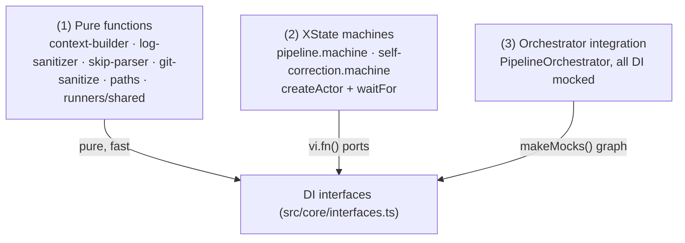

# 7. Testing Strategy & Mock Patterns

> **Target Audience:** Contributors writing or extending the test suite.
> **Status:** DRAFT — grounded in `test/`, `vitest.config.ts`, and the DI contracts in `src/core/interfaces.ts`.
> **Prev:** [6. Observability, Logging, & Operations](06-observability-operations.md) · **Next:** [8. Developer Guide](08-developer-guide.md)

---

## Overview

The suite is a **three-tier test pyramid** that leans on the same DI contract that decouples the core engine from the OS (see [5. CLI & Dependency Injection Wiring](05-cli-di-wiring.md)):

1. **Pure function tests** — unit-test `context-builder`, `context-provider`, `log-sanitizer`, `skip-parser`, `git-sanitize`, `paths`, and `runners/shared`. No mocks needed (or trivial ones).
2. **Machine tests** — exercise the XState machines directly with `createActor` + `waitFor`, injecting `vi.fn()` mocks for every port.
3. **Orchestrator / integration tests** — drive the full 8-pass pipeline through `PipelineOrchestrator` with the entire service graph mocked.



### Two isolation regimes

| Regime | Where | Rule | Real I/O allowed? |
|---|---|---|---|
| **In-memory DI** | core, machines, orchestrator, CLI | inject `vi.fn()`/`StubLogger` for every dependency; stub the full interface | **No** |
| **Concrete-adapter** | `test/infrastructure/infrastructure.test.ts`, `state-store.test.ts` | exercise the real adapter but against **ephemeral OS temp dirs** (`mkdtemp` in `os.tmpdir()`), cleaned in `afterEach` | Yes, but only inside `tmpdir()` |

> [!IMPORTANT]
> The suite **must never** touch the workspaces's real filesystem, run real `git` commands against the repo, or invoke the real `opencode` binary. `IOpencodeSpawner` is always mocked; concrete git/fs logic is exercised only against `os.tmpdir()` scratch space (see §6).

---

## 1. Test Suite Layout

Vitest is configured in [`vitest.config.ts`](../../../vitest.config.ts): `globals: true`, `environment: 'node'`, discovering both `src/**/*.test.ts` and `test/**/*.test.ts`. Run with `npm test` (`vitest run`), watch with `npm run test:watch`, type-check with `npm run lint` (`tsc --noEmit`).

| Test file | Layer | Subject under test | Isolation |
|---|---|---|---|
| [`test/orchestrator.test.ts`](../../../test/orchestrator.test.ts) | 3 | `PipelineOrchestrator` end-to-end over 8 passes | `makeMocks()` + `StubLogger` |
| [`test/machines/pipeline.machine.test.ts`](../../../test/machines/pipeline.machine.test.ts) | 2 | pipeline machine actors | `createActor`/`waitFor` + mocks |
| [`test/machines/self-correction.machine.test.ts`](../../../test/machines/self-correction.machine.test.ts) | 2 | self-correction machine (retries, compaction) | `createActor`/`waitFor` + mocks |
| [`test/core/context-builder.test.ts`](../../../test/core/context-builder.test.ts) | 1 | context builder | pure |
| [`test/core/context-provider.test.ts`](../../../test/core/context-provider.test.ts) | 1 | `IContextProvider` impl | pure |
| [`test/core/log-sanitizer.test.ts`](../../../test/core/log-sanitizer.test.ts) | 1 | sanitizer rules | pure |
| [`test/core/runners/shared.test.ts`](../../../test/core/runners/shared.test.ts) | 1 | `getAgentContextPayload` | pure |
| [`test/infrastructure/ast-grep-symbol-resolver.test.ts`](../../../test/infrastructure/ast-grep-symbol-resolver.test.ts) | 1 | `ISymbolResolver` impl (in-memory parse) | pure, no fs |
| [`test/infrastructure/open-code-agent-runner.test.ts`](../../../test/infrastructure/open-code-agent-runner.test.ts) | 2 | argv assembly, pass-log write | `IOpencodeSpawner` mock |
| [`test/infrastructure/infrastructure.test.ts`](../../../test/infrastructure/infrastructure.test.ts) | adapter | `NodeFileSystem`, `EventBus`, `GitService`, `CommandRunner` | temp dirs |
| [`test/infrastructure/state-store.test.ts`](../../../test/infrastructure/state-store.test.ts) | adapter | `JsonStateStore` | temp dirs |
| [`test/cli/*.test.ts`](../../../test/cli/) | UI/CLI | renderer, hitl-handler, session, sigint, validators, di-container, event-listener | `TerminalWriter` stub / mocks |
| [`test/utils/*.test.ts`](../../../test/utils/) | 1 | `git-sanitize`, `paths` | pure |

---

## 2. Why the DI Contract Makes This Easy

Every OS side-effect is behind a port in [`src/core/interfaces.ts`](../../../src/core/interfaces.ts): `IGitService` ([#L19-L85](../../../src/core/interfaces.ts#L19-L85)), `IFileSystem` ([#L91-L112](../../../src/core/interfaces.ts#L91-L112)), `ICommandRunner` ([#L118-L126](../../../src/core/interfaces.ts#L118-L126)), `IAgentRunner` ([#L132-L144](../../../src/core/interfaces.ts#L132-L144)), `IOpencodeSpawner` ([#L150-L163](../../../src/core/interfaces.ts#L150-L163)), `IEventBus` ([#L169-L179](../../../src/core/interfaces.ts#L169-L179)), `IStateStore` ([#L185-L193](../../../src/core/interfaces.ts#L185-L193)), `ILogger` ([#L199-L207](../../../src/core/interfaces.ts#L199-L207)), `ISymbolResolver` ([#L222-L237](../../../src/core/interfaces.ts#L222-L237)), and `IContextProvider` ([#L243-L255](../../../src/core/interfaces.ts#L243-L255)).

Because the engine depends only on these contracts — never `child_process`, `fs`, or `console` directly — a test can hand it a graph of `vi.fn()` mocks and assert on calls, return values, and emitted events without any side effects. This is the architectural consequence of [ADR-0001](../adrs/0001-pure-core-engine.md).

---

## 3. The DI Mock Inventory (resolves T-1)

| Interface (`interfaces.ts`) | Stub / Mock factory | Example |
|---|---|---|
| `IGitService` | `makeMocks().git` — every method `vi.fn()`, defaults pre-loaded (e.g. `commit → { kind: 'committed' }`, `getPendingChanges → [{ status: 'M', file }]`) | [`orchestrator.test.ts#L103-L113`](../../../test/orchestrator.test.ts#L103-L113) |
| `IFileSystem` | `vi.fn()` per method incl. `readFile`, `writeFile`, `deleteFile`, `readdir` | [`orchestrator.test.ts#L115-L123`](../../../test/orchestrator.test.ts#L115-L123) |
| `ICommandRunner` | `.runTests → { passed: true, output: '' }`; flip to `{ passed: false }` for retry/compaction tests | [`self-correction.machine.test.ts#L93-L95`](../../../test/machines/self-correction.machine.test.ts#L93-L95) |
| `IAgentRunner` | `.execute → { output }`; re-mock per pass via `mockImplementation(req => …req.pass…)` for SKIP/ordering tests | [`orchestrator.test.ts#L716-L723`](../../../test/orchestrator.test.ts#L716-L723) |
| `IOpencodeSpawner` | `.spawn → 'agent output'`; assert on captured argv, reject to test error propagation | [`open-code-agent-runner.test.ts#L86-L91`](../../../test/infrastructure/open-code-agent-runner.test.ts#L86-L91) |
| `IEventBus` | In-memory `_listeners` map whose `emit` synchronously invokes handlers — enables asserting on both emitted events and listener reactions | [`orchestrator.test.ts#L133-L159`](../../../test/orchestrator.test.ts#L133-L159) |
| `ILogger` | `StubLogger` class (records `calls`, `child` returns self, `level` getter) | [`orchestrator.test.ts#L54-L80`](../../../test/orchestrator.test.ts#L54-L80) |
| `IStateStore` | `.save/load/delete/exists` mocks; assert `save` was called with a ctx carrying `xstateSnapshot` | [`orchestrator.test.ts#L166-L172`](../../../test/orchestrator.test.ts#L166-L172) |
| `IContextProvider` | `.build → minimal BuiltContext` | [`orchestrator.test.ts#L178-L183`](../../../test/orchestrator.test.ts#L178-L183) |
| `ISymbolResolver` | only needed in machine tests (e.g. `pipeline.machine.test.ts$L109`) | `vi.fn()` |
| `HitlHandler` | plain `vi.fn().mockResolvedValue('APPROVE')` (or `REJECT`/`REWIND`) | [`orchestrator.test.ts#L174`](../../../test/orchestrator.test.ts#L174) |

> [!NOTE]
> Stubs **MUST** satisfy the **full** interface — TypeScript `strict` + `noUncheckedIndexedAccess` will reject a stub that omits a method. This is intentional: a missing port fails at compile time, not at runtime, keeping the DI contract honest (see `test/cli/terminal-event-listener.test.ts` which builds a `EventBusStub` with a `trigger` helper to fire kinds on demand).

---

## 4. The StubLogger Pattern

`StubLogger` (implementing `ILogger`) is duplicated intentionally across the top-level suites because each file is self-contained. It:

- records every call as `{ method, args }` in `calls` — enabling assertions like `m.logger.calls.filter(c => c.method === 'warn')` ([`orchestrator.test.ts#L678-L679`](../../../test/orchestrator.test.ts#L678-L679));
- returns `this` from `child()` so binding never breaks call capture;
- exposes a `get level()` returning `'info'` by default — override via `Object.defineProperty(stub, 'level', { value: 'debug' })` to exercise debug-only code paths ([`open-code-agent-runner.test.ts#L171-L185`](../../../test/infrastructure/open-code-agent-runner.test.ts#L171-L185)).

> [!TIP]
> The `level` getter drives real behaviour: `OpenCodeAgentRunner` injects `--print-logs --log-level DEBUG` only when the logger's `level` is `debug` (see [6. Observability §1.2](06-observability-operations.md#12-level-selection)). Controlling it makes that branch testable.

---

## 5. Factory Helpers

Every suite defines three small helpers that keep tests declarative:

| Helper | Purpose | Example |
|---|---|---|
| `makeContext(overrides)` | Builds a valid `PipelineContext` with safe throwaway paths under `/project/…`, merging `overrides` | [`orchestrator.test.ts#L28-L48`](../../../test/orchestrator.test.ts#L28-L48) |
| `makeMocks()` | Returns a fresh object of `vi.fn()` mocks for every service, plus `emittedEvents` and `logger` | [`orchestrator.test.ts#L100-L186`](../../../test/orchestrator.test.ts#L100-L186) |
| `findEvents(events, kind)` | Filters an `AgenticEvent[]` by kind for targeted assertions | [`orchestrator.test.ts#L192-L194`](../../../test/orchestrator.test.ts#L192-L194) |

Because `makeMocks()` returns fresh mocks per call, tests are isolated — no shared mutable state leaks between cases (no `beforeEach` reset needed in most files).

---

## 6. Testing Concrete Infrastructure Adapters

Concrete adapters that must do real I/O are exercised **against ephemeral OS temp dirs**, never the repo:

```ts
beforeEach(async () => { dir = await mkdtemp(join(tmpdir(), 'agentic-tdd-fs-test-')); });
afterEach(async () => { await rm(dir, { recursive: true, force: true }); });
```

- [`infrastructure.test.ts#L20-L26`](../../../test/infrastructure/infrastructure.test.ts#L20-L26) — lifecycle for `NodeFileSystem`, `JsonStateStore` tests; verifies write/read/delete/recursive-mkdir against real `fs` semantics without polluting the workspace.
- `JsonStateStore` (with a real `NodeFileSystem` bound to `workDir`) validates feature-name sanitisation and round-trip persistence in [`state-store.test.ts#L28-L50`](../../../test/infrastructure/state-store.test.ts#L28-L50).
- Process spawning (`GitService`, `CommandRunner`) is covered the same way, but `opencode` itself is **never spawned** — its contract is faked through `IOpencodeSpawner` (see §3).

> [!NOTE]
> `ast-grep-symbol-resolver.test.ts` is pure in-memory: it feeds TS source strings to `mapRangesToSymbols` and asserts returned qualified names — the resolver **MUST NOT** read the filesystem per its interface doc ([`interfaces.ts#L222-L237`](../../../src/core/interfaces.ts#L222-L237)).

---

## 7. Machine Testing with XState (resolves T-2)

The machines are tested as real XState actors, not through the orchestrator:

```ts
const actor = createActor(machine, { input: { ctx, pass: PipelinePass.CoreImplementation } });
actor.start();
await waitFor(actor, (s) => s.status === 'done' || s.status === 'error');
expect(actor.getSnapshot().status).toBe('done');
```

See [`self-correction.machine.test.ts#L146-L178`](../../../test/machines/self-correction.machine.test.ts#L146-L178) and [`pipeline.machine.test.ts`](../../../test/machines/pipeline.machine.test.ts). Patterns grounded here:

- **Happy-path phase assertions** — `agentRunner.execute` and `cmd.runTests` each called once ([#L180-L199](../../../test/machines/self-correction.machine.test.ts#L180-L199)); correct event kinds emitted ([#L201-L222](../../../test/machines/self-correction.machine.test.ts#L201-L222)).
- **Call ordering** — mutate `mockImplementation` to push into a `callOrder` array, asserting `agent` before `tests` ([#L266-L296](../../../test/machines/self-correction.machine.test.ts#L266-L296)).
- **Side-effect positive/negative** — e.g. success calls `deleteFile(errorLogPath)` (Context Compaction, [ADR-0005](../adrs/0005-context-compaction.md)); failure paths exhaust retry budget and emit `ERROR`.
- **Persistence** — `actor.getPersistedSnapshot()` verifies the machine is serializable, which backs `--resume`/pause.

> [!IMPORTANT]
> `waitFor` is the correct tool for asserting terminal states. Do **not** rely on fixed `setTimeout` sleeps — the actor's transitions resolve asynchronously.

---

## 8. Orchestrator Integration Tests

`test/orchestrator.test.ts` drives the whole pipeline through `PipelineOrchestrator` with `makeMocks()`. Representative contracts:

- **Happy path** — 8 `agentRunner.execute` calls, 5 `cmd.runTests` calls (passes 3–7), 8 `git.commit` calls ([#L202-L246](../../../test/orchestrator.test.ts#L202-L246)).
- **Event-sequence characterization** — the full ordered `emittedEvents.map(e => e.kind)` captured with `toMatchInlineSnapshot` ([#L282-L328](../../../test/orchestrator.test.ts#L282-L328)). Inline snapshots pin regressions in event ordering.
- **HITL gating** — `skipHitl:false` produces two `HITL_REQUIRED` events (Pass 0 and Pass 2) and invokes the handler; a throwing handler aborts the pipeline **before any commit** ([#L331-L381](../../../test/orchestrator.test.ts#L331-L381)).
- **Resume / rebase** — `run(ctx, PipelinePass.X)` replays from a starting pass; snapshot reseeding short-circuits completed passes ([#L450-L534](../../../test/orchestrator.test.ts#L450-L534)).
- **Pause / resume** — a *deferred promise* (with a manully-released `resolveBlock`) parks the actor mid-run, then `pause()` persists a `status:'active'`/`value:'paused'` snapshot ([#L536-L663](../../../test/orchestrator.test.ts#L536-L663)).
- **SKIP parsing** — `parseSkipSignal` unit cases plus end-to-end skip behaviour (7 commits when Pass 1 is skipped) ([#L706-L746](../../../test/orchestrator.test.ts#L706-L746)).

---

## 9. CLI & Renderer Snapshot Testing

Terminal output is made testable by injecting `TerminalWriter` instead of calling `console.*` directly ([`terminal-renderer.ts#L24-L34`](../../../src/cli/terminal-renderer.ts#L24-L34)). Tests use a `makeWriter()` stub that records `logs/warns/errors` arrays and assert on exact line content — e.g. `passHeader` writes 5 lines with a 68-char ruler ([`terminal-renderer.test.ts#L53-L74`](../../../test/cli/terminal-renderer.test.ts#L53-L74)). Event-to-renderer mapping is verified with `attachTerminalListener` + an `EventBusStub.trigger` ([`terminal-event-listener.test.ts#L14-L42`](../../../test/cli/terminal-event-listener.test.ts#L14-L42)).

---

## 10. The Coverage Contract

AGENTS.md §6 and `docs/STYLE_GUIDE.md` require, for **every new public method or interface**:

1. **≥ 1 positive test** — the expected behaviour succeeds.
2. **≥ 1 negative test** — the failure path is asserted (rejection, fallback, or `warn`).

This mirrors the pipeline's own testing philosophy ([Pass 2 — Test Generation](02-prompt-engineering.md)): tests encode intent and must stay green — never commented out or `.skip`'d.

---

## Placeholders / Open Questions

| # | Topic | What is missing |
|---|---|---|
| T-3 | Shared mock-factory extraction | `StubLogger`/`makeMocks`/`makeContext` are duplicated per suite. Could be hoisted into a shared `test/helpers/` module — but doing so couples suites; decide whether the duplication is worth the isolation. |
| T-4 | Coverage reporting | No coverage threshold (`@vitest/coverage` not configured); `npm test` reports pass/fail only. Consider a minimum-coverage gate for `src/core/`. |
| T-5 | Infra git tests depth | `GitService`/`CommandRunner` adapter tests are thin; full command-contract coverage (dirty detection, `abortToSha`, watchdog timeouts) needs more cases. |

---

## Related

- [5. CLI & Dependency Injection Wiring](05-cli-di-wiring.md) — how stubs map to the real container in `di-container.ts`
- [6. Observability, Logging, & Operations](06-observability-operations.md) — how `StubLogger` and the `level` getter are used to exercise debug-only branches
- [1. Core Engine Internals](01-core-engine-internals.md) — the machines under test
- [ADR-0001 — Pure Core Engine](../adrs/0001-pure-core-engine.md) — architectural basis for the DI-driven testability
- [ADR-0005 — Context Compaction](../adrs/0005-context-compaction.md) — asserted via `deleteFile(errorLogPath)` on success
