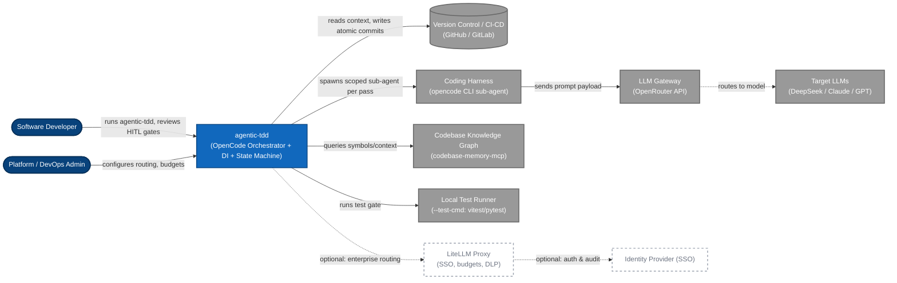
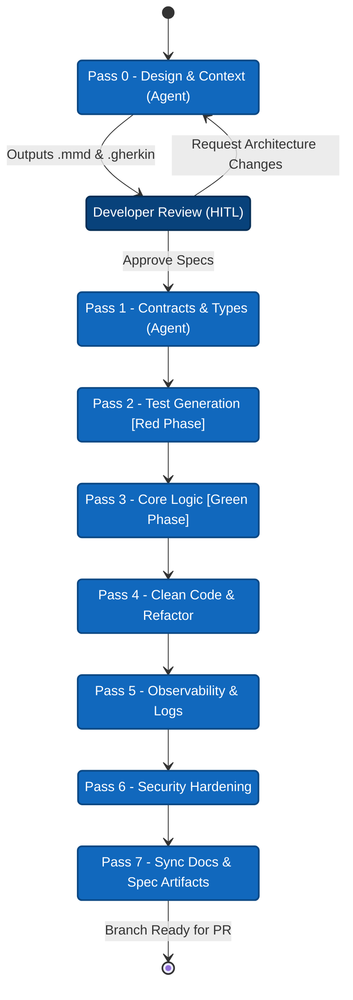

# 2. High-Level Architecture

> **Target Audience:** Users — CTOs, Team Leads, and Architects evaluating agentic-tdd.
> **Key Goal:** Explain *how the system is put together at a glance* — the actors, external systems, and the 8-pass flow — so evaluators can reason about security, cost, and integration without reading source code.
> **Status:** Published (v0.1.0-Beta) — Page 2 of the User Overview. Diagrams are grounded in the implemented `src/` code; enterprise "vision" components are explicitly flagged as planned.

---

## Executive Summary

`agentic-tdd` is a **Node.js / TypeScript CLI** that sits in front of a **coding-harness agent** (today, [opencode](https://opencode.ai)) and an **LLM provider** (today, [OpenRouter](https://openrouter.ai)). It is architecturally split into three strict layers:

| Layer | Directory | Responsibility |
|---|---|---|
| **Entry & Wiring** | `src/cli/` | CLI parsing, session lifecycle, DI container, terminal UI, HITL prompts |
| **Core Engine** | `src/core/` | Pure state machine — pipeline orchestration, context building, contracts (zero OS/Git imports) |
| **Infrastructure** | `src/infrastructure/` | Concrete adapters — git, filesystem, process spawning, agent runner, logging, state store, symbol resolution |

The hard architectural rule ([ADR-0001 — Pure Core Engine](../adrs/0001-pure-core-engine.md)): **`src/core/` MUST NOT import from `src/infrastructure/` or `src/cli/`.** Every OS side-effect is expressed as an interface in [`src/core/interfaces.ts`](../../../src/core/interfaces.ts) and injected into the engine at construction time.

> [!TIP]
> This page is C4 Level 1 for the *shipped* system. The broader enterprise vision — SSO, budget enforcement, cross-repo indexing, sandboxing — lives in [8. Engineering Concepts — planned list](08-engineering-concepts.md#concepts-that-are-planned-not-shipped) and [9. ADRs & Roadmap](../contributor-deep-dive/09-adrs-roadmap.md), and is flagged `planned` here because it is not yet shipped.

---

## 1. System Context (C4 Level 1)

### Actors

| Actor | Interaction |
|---|---|
| **Software Developer** | Triggers the pipeline (`agentic-tdd --feature-desc-file specs/feature.md`), approves the Pass 0 design artifacts (**HITL**), reviews each atomic commit, pauses/resumes/aborts. |
| **Platform / DevOps Admin** | Configures model routing, budgets, and enterprise gateway options (`infra/`). Today this is largely manual `.env`/agent-file editing; the LiteLLM admin surface is `planned`. |

### External Systems

| System | Purpose | Status |
|---|---|---|
| **Coding Harness (opencode)** | The sub-agent that reads the scoped prompt and performs file edits. Spawned per pass via `OpenCodeAgentRunner` ([`src/infrastructure/open-code-agent-runner.ts#L11`](../../../src/infrastructure/open-code-agent-runner.ts#L11)). | Shipped |
| **LLM Gateway (OpenRouter)** | Provider-agnostic API endpoint the harness calls (the default provider). API key read from `.env` (`OPENROUTER_API_KEY`; `DEEPSEEK_API_KEY` when models are overridden to the `deepseek/...` provider). | Shipped |
| **Version Control / CI** | Source of truth for context and the destination for atomic per-pass commits. | Shipped |
| **Codebase Knowledge Graph (`codebase-memory-mcp`)** | Semantic/AST index queried to build accurate context (fewer hallucinations / duplicate utilities). | Shipped |
| **Local Test Runner** | Deterministic verification gate (`--test-cmd`), language-agnostic (vitest, pytest, etc.). | Shipped |
| **LiteLLM Proxy** | Optional self-hosted gateway (`infra/docker-compose.yml`) for SSO, budgets (402), DLP masking. | Planned / optional |

---

## 2. Architecture at a Glance

The whole system is one explicit flow: eight specialised agents in strict sequence, each gated by your local test suite before an atomic commit.

> [!NOTE]
> This is the simplified flow. The full diagram including the **test gates** and self-correction loops after each guarded pass (3–7) — and the per-pass atomic-commit story that powers rollback, pause, resume, and abort — is on **[3. The 8-Pass Pipeline](03-8-pass-pipeline.md)**.

---

## 3. Key Architectural Decisions

These decisions shape the structure you see above. Each is a one-line summary here; full rationale in the linked ADRs and [1. Why This Exists](01-why-this-exists.md).

| # | Decision | Rationale (summary) | Implementation / Evidence |
|---|---|---|---|
| **B.1** | **Language: Node.js / TypeScript** (not Python) | Ecosystem interop, strong typing, existing tooling. | `package.json`; `src/` entirely TS (strict). |
| **B.2** | **State machine: XState** over ad-hoc loops | Explicit states/transitions/guards → deterministic, testable orchestration. | [ADR-0002](../adrs/0002-xstate-machines.md); `src/core/machines/`. |
| **B.3** | **Code parsing: `@ast-grep/napi`** (vs web-tree-sitter) | In-process, real-time high-quality context; tree-sitter possible later. | [ADR-0007](../adrs/0007-ast-grep-symbol-resolver.md); `ast-grep-symbol-resolver.ts`. |
| **B.4** | **Code-indexing: `codebase-memory-mcp`** (vs opencode's inbuilt indexer) | Independence from any single harness + accurate context → fewer hallucinations / duplicate utilities. | `search_graph`/`query_graph` tools; Pass 0 `indexer-first` directive. |
| **B.5** | **Minimal own-surface: delegate to the harness** | Don't re-implement what opencode does well; keep agentic-tdd portable to other harnesses (e.g. lightweight `pi`). | `IAgentRunner` / `IOpencodeSpawner` ports; [1. § 2.6 Harness Independence](01-why-this-exists.md#26-harness-independence). |

> [!NOTE] Harness independence
> Because the agent is reached only through the `IAgentRunner` / `IOpencodeSpawner` ports, swapping opencode for another CLI agent (ClaudeCode, `pi`, …) is an adapter change, not an engine change. See [1. Why This Exists § 2.6](01-why-this-exists.md#26-harness-independence).

---

## 4. Placeholders & Open Questions

| # | Topic | What is missing |
|---|---|---|
| H-1 | **LiteLLM status** | `infra/docker-compose.yml` + `litellm_config.yaml` exist; confirm whether the SSO/budget features are exercised anywhere. Re-check when infra matures (see [6. Context Engineering](06-context-and-token-savings.md) C-2). |
| H-2 | **Harness swap (`pi`)** | `pi` as default harness is planned, not shipped — diagram/actor list must be updated if the default harness changes. |

---

## Related Pages

- Previous: [Architecture index](../README.md)
- Next: [3. The 8-Pass Pipeline](03-8-pass-pipeline.md)
- Deep dives: [4. The Core Engine](04-core-engine.md) · [1. Core Engine Internals](../contributor-deep-dive/01-core-engine-internals.md) · [5. CLI & DI Wiring](../contributor-deep-dive/05-cli-di-wiring.md)
- ADRs: [0001 Pure Core Engine](../adrs/0001-pure-core-engine.md) · [0002 XState Machines](../adrs/0002-xstate-machines.md) · [0007 AST-Grep Symbol Resolver](../adrs/0007-ast-grep-symbol-resolver.md)
- Vision: [9. ADRs & Roadmap](../contributor-deep-dive/09-adrs-roadmap.md) · [8. Engineering Concepts](08-engineering-concepts.md)
