# 3. The 8-Pass Pipeline

> **Target Audience:** Users — CTOs, Team Leads, and Architects evaluating agentic-tdd.
> **Key Goal:** Explain the 8-pass flow — what each pass does, its inputs and gates — and how *one atomic git commit per pass* makes the pipeline deterministic, resumable, and safe to roll back.
> **Status:** Published (v0.1.0-Beta) — Page 3 of the User Overview. Diagram and table are grounded in `src/agents/pass-*.md` and `src/core/types.ts`; the rollback section is grounded in `src/core/machines/pipeline.machine.ts` and `src/cli/session.ts`.

---

## Executive Summary

The pipeline is the embodiment of **"AI as an assembly line"** (see [1. Why This Exists](01-why-this-exists.md)): eight specialised sub-agents run in strict sequence, each with a narrow scope. Two properties make the sequence safe:

1. **N's output is N+1's read-only context** — the next pass sees the previous pass's committed work, not a shared scratch space.
2. **Every pass that touches files ends in one atomic git commit** — so you can always `git revert` exactly one step, and pause/resume/abort never leave the repo in a half-written state.

> [!NOTE] The pass order
> Pass 5 is **Observability & Logging** and Pass 6 is **Security Hardening** (not the reverse). This was a deliberate swap — see [ADR-0008 — Observability Before Security](../adrs/0008-observability-before-security.md): security reviewers must see the log statements to catch PII leakage in `logger.error()` calls.

---

## 1. The Pipeline at a Glance

```mermaid
stateDiagram-v2
    classDef human fill:#08427b,color:#fff,stroke:#052e56,stroke-width:2px
    classDef agent fill:#1168bd,color:#fff,stroke:#0b4884,stroke-width:2px
    classDef testGate fill:#2dd4bf,color:#000,stroke:#0f766e,stroke-width:2px
    classDef commit fill:#f59e0b,color:#000,stroke:#b45309,stroke-width:2px

    [*] --> Pass_0

    Pass_0 : Pass 0 - Design & Context (Agent)
    class Pass_0 agent

    HITL : Developer Review (HITL)
    class HITL human

    Pass_1 : Pass 1 - Contracts & Types (Agent)
    class Pass_1 agent

    Commit_1 : Git Commit
    class Commit_1 commit

    Pass_2 : Pass 2 - Test Generation [Red Phase]
    class Pass_2 agent

    HITL_2 : Developer Review (HITL)
    class HITL_2 human

    Pass_3 : Pass 3 - Core Logic [Green Phase]
    class Pass_3 agent

    Gate_3 : Test Runner (Verify Core)
    class Gate_3 testGate

    Pass_4 : Pass 4 - Clean Code & Refactor
    class Pass_4 agent

    Gate_4 : Test Runner (Verify Refactor)
    class Gate_4 testGate

    Pass_5 : Pass 5 - Observability & Logs
    class Pass_5 agent

    Gate_5 : Test Runner (Verify Observability)
    class Gate_5 testGate

    Pass_6 : Pass 6 - Security Hardening
    class Pass_6 agent

    Gate_6 : Test Runner (Verify Security)
    class Gate_6 testGate

    Pass_7 : Pass 7 - Sync Docs & Spec Artifacts
    class Pass_7 agent

    Gate_7 : Final CI/CD Verification
    class Gate_7 testGate

    Pass_0 --> HITL : Outputs .mmd & .gherkin
    HITL --> Pass_0 : Request Architecture Changes
    HITL --> Pass_1 : Approve Specs (Git Commit)

    Pass_1 --> Commit_1
    Commit_1 --> Pass_2

    Pass_2 --> HITL_2
    HITL_2 --> Pass_2 : Request Test Changes
    HITL_2 --> Pass_3 : Approve Tests (Git Commit)

    Pass_3 --> Gate_3
    Gate_3 --> Pass_3 : Tests Failed (Fix Core)
    Gate_3 --> Pass_4 : Tests Passed (Git Commit)

    Pass_4 --> Gate_4
    Gate_4 --> Pass_4 : Refactor Broke Logic (Revert & Fix)
    Gate_4 --> Pass_5 : Tests Passed (Git Commit)

    Pass_5 --> Gate_5
    Gate_5 --> Pass_5 : Logs Broke Scopes/Types (Fix)
    Gate_5 --> Pass_6 : Tests Passed (Git Commit)

    Pass_6 --> Gate_6
    Gate_6 --> Pass_6 : Security Blocked Valid Logic (Fix)
    Gate_6 --> Pass_7 : Tests Passed (Git Commit)

    Pass_7 --> Gate_7
    Gate_7 --> Pass_7 : Spec Drift Detected (Update Specs)
    Gate_7 --> [*] : Branch Ready for PR
```



---

## 2. Pass Reference Table

Compiled from the shipped agent files ([`src/agents/pass-0..7-*.md`](../../../src/agents/)) and [`src/core/types.ts`](../../../src/core/types.ts). Note that each agent can be configured with its own model. We have tested with GLM, Deepseek and Gemini. We recommend GLM 5.2 (or Deepseek-v4-pro) for Passes 0,1,2 and Deepseek V4 Flash for rest of the passes i.e. Code Generation, Refactoring, Observability, Security and Documentation.

| Pass | Agent (file) | Default model | Context in | Gate / verification |
|---|---|---|---|---|
| **0. Design & Architecture** | `pass-0-design-agent` | `deepseek/deepseek-v4-pro` | Feature description + codebase knowledge graph (`codebase-memory-mcp`) | **HITL** approve/rewind/reject; artefact length validation |
| **1. Contracts & Types** | `pass-1-contracts-agent` | `deepseek/deepseek-v4-pro` | `design.mmd`, `spec.gherkin`, source files | None (adds stubs/types only) |
| **2. Test Generation (Red Phase)** | `pass-2-test-generation-agent` | `deepseek/deepseek-v4-pro` | Gherkin spec + Pass 1 contracts | **HITL** + tests must **fail** (confirms constraints) |
| **3. Core Implementation (Green Phase)** | `pass-3-core-implementation-agent` | `deepseek/deepseek-v4-pro` | `design.mmd` (binding contract) + tests + contracts | Test gate + **self-correction loop** |
| **4. Refactor & Optimise** | `pass-4-refactor-agent` | `deepseek/deepseek-v4-pro` | Pass 3 output | Test gate + self-correction loop |
| **5. Observability & Logging** | `pass-5-observability-agent` | `deepseek/deepseek-v4-pro` | Pass 4 output | Test gate + self-correction loop |
| **6. Security Hardening** | `pass-6-security-agent` | `deepseek/deepseek-v4-pro` | Pass 5 output (incl. log statements) | Test gate + self-correction loop; OWASP Top-10 review |
| **7. Documentation & Spec-Sync** | `pass-7-documentation-agent` | `deepseek/deepseek-v4-flash` | Finalised implementation | Test gate + spec-drift check; `@see` links to `.mmd` |

**Shared guardrails (all passes):** read/edit/glob/grep allowed; `bash`, `webfetch`, `task` denied (no arbitrary execution, no network, no sub-agents). See [5. Agent Prompt System & Routing](05-agent-prompt-system.md).

> [!TIP] Self-correction loop
> Guarded passes (3–7) run your local test suite after each agent run. On failure, the error log is fed back to the same agent for up to **3 retries** ([`DEFAULT_MAX_CORRECTION_RETRIES`](../../../src/core/types.ts#L74)). If tests still fail, the pass fails and the pipeline stops. Implemented by `createSelfCorrectionMachine`.

---

## 3. Human-in-the-Loop (HITL) Gates

The shipped pipeline has **two** human gates — after Pass 0 and after Pass 2 ([`HITL_GATE_PASSES`](../../../src/core/types.ts#L77)):

| Gate | What you review | Actions |
|---|---|---|
| **After Pass 0** | `design.mmd` + `spec.gherkin` | Enter = approve · `r` = rewind (re-run Pass 0) · `x` = reject/abort |
| **After Pass 2** | generated test suite (Red Phase) | Enter = approve · `r` = rewind · `x` = reject/abort |

The interaction is a readline prompt in [`src/cli/hitl-handler.ts`](../../../src/cli/hitl-handler.ts); the gate itself is the `HITL_REQUIRED` event emitted by the XState machine. Use `--skip-hitl` for unattended CI runs.

> [!NOTE] ADR-0004 title is stale
> [ADR-0004 — HITL Gate After Pass 0 Only](../adrs/0004-hitl-gate-after-pass-0.md) documents the shipped **two** gates (Pass 0 + Pass 2); only its title still reads "After Pass 0 Only" — see open item [H-2](../adrs/0004-hitl-gate-after-pass-0.md#placeholders--open-items).

---

## 4. One Atomic Commit Per Pass → Rollback, Pause, Resume, Abort

This is the property that makes the whole pipeline *deterministic and reversible*: **each pass that touches files produces exactly one atomic git commit** ([`GIT_COMMIT_PASSES`](../../../src/core/types.ts#L62) = all passes 0–7).

### 4.1 What happens on every pass

1. The agent runs and edits files.
2. The machine captures pending changes via `IGitService.getPendingChanges()`.
3. If nothing changed, the pass is recorded as an **implicit skip** — no commit.
4. Otherwise `doAtomicCommit` ([`src/core/machines/pipeline.machine.ts#L871`](../../../src/core/machines/pipeline.machine.ts#L871)) stages `.` + the state file and commits with a parseable message:

```text
chore(ai): completed Pass 3 -- Core Implementation (Green Phase) - <featureName>
```

5. The commit SHA is stored in the pass history, and the diff is resolved to symbols for the next pass's context.

### 4.2 Why this makes rollback trivial

Because every pass is a **separate, atomic commit**, the full history looks like a clean, ordered stack:

```text
d72ad0a chore(ai): completed Pass 0 -- Design & Architecture - payments-api
0da8f7c chore(ai): completed Pass 1 -- Contracts & Types - payments-api
…       chore(ai): completed Pass N -- <label> - <featureName>
```

If a later pass (say Pass 3) breaks something, you roll back exactly one step:

```bash
git revert <sha-of-pass-3>
```

No half-applied diffs, no squashed "one big AI commit" you can't untangle. See [ADR-0003 — Atomic Commits Per Pass](../adrs/0003-atomic-commits-per-pass.md).

### 4.3 Pause / Resume / Abort

The commit-per-pass boundary is what makes pause/resume/abort safe — the repo is always in a consistent, committed state between passes.

| Operation | How | What makes it safe |
|---|---|---|
| **Pause** | `Ctrl+C` (SIGINT) → the current pass completes and commits, then the machine parks in a `paused` state ([`PipelineOrchestrator.pause`](../../../src/core/orchestrator.ts#L65-L78)) | The `xstateSnapshot` is persisted, so no state is lost mid-pass |
| **Resume** | `agentic-tdd --resume` → replays the `xstateSnapshot`, or fast-forwards from the last completed pass ([`resumeSession`](../../../src/cli/session.ts#L61-L158)) | Commit message format lets the engine find `getLastCompletedPass` |
| **Abort** | `agentic-tdd --abort` → `git reset --hard <originalBaseSha>` + delete state file ([`abortSession`](../../../src/cli/session.ts#L40-L59)) | The baseline SHA was recorded when the session started, so the whole run rewinds in one shot |

> [!TIP] The baseline SHA (`originalBaseSha`)
> When a session starts, the engine records the SHA of the branch tip *before* any AI commit. `--abort` rewinds to it — undoing the entire 8-pass run — while a per-pass `git revert` undoes just one step. Full reversal is a stack-pop; partial reversal is a precise revert.

---

## Placeholders / Open Questions

| # | Topic | What is missing |
|---|---|---|
| P-1 | Model routing truth | Defaults confirmed from agent files; re-check if agent frontmatter changes (see [5. Agent Prompt System](05-agent-prompt-system.md) R-2). |
| P-2 | ADR-0004 vs two gates | Resolved — ADR-0004 now documents the shipped two-gate behaviour; the title rename is tracked as ADR-0004 open item H-2. |
| P-3 | HITL UI fidelity | Screenshots / exact terminal rendering of the gate (see [`terminal-renderer.ts`](../../../src/cli/terminal-renderer.ts)). |

---

## Related Pages

- Previous: [2. High-Level Architecture](02-high-level-architecture.md)
- Next: [4. The Core Engine](04-core-engine.md)
- Deep dives: [1. Core Engine Internals — State Machines](../contributor-deep-dive/01-core-engine-internals.md) · [5. CLI & DI Wiring — data flow](../contributor-deep-dive/05-cli-di-wiring.md)
- ADRs: [0003 Atomic Commits Per Pass](../adrs/0003-atomic-commits-per-pass.md) · [0004 HITL Gate](../adrs/0004-hitl-gate-after-pass-0.md) · [0008 Observability Before Security](../adrs/0008-observability-before-security.md)
