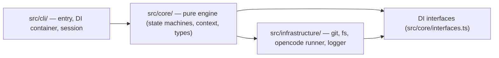

# 4. The Core Engine

> **Target Audience:** Users — CTOs, Team Leads, and Architects (high-level; contributor details live in the Contributor Track).
> **Status:** DRAFT — high-level overview; deep internals in the Contributor Track.

---

## What the Core Engine Is

The core engine is the **pure state machine** at the heart of agentic-tdd. It has two strict properties:

- **Zero OS/Git imports.** `src/core/` never touches the filesystem, git, or processes directly.
- **Everything side-effecting is injected.** All filesystem, git, process, and logging operations arrive via Dependency Injection interfaces ([`src/core/interfaces.ts`](../../../src/core/interfaces.ts)); the engine only depends on those contracts. See [ADR-0001 — Pure Core Engine](../adrs/0001-pure-core-engine.md).

This makes the engine **fully unit-testable** (inject mocks) and **embeddable** (e.g. a future VS Code extension can reuse it unchanged).

> [!NOTE] Why pure?
> If the state machine could read the filesystem or run git directly, you could never test it without a live environment, and you could never embed it in another host. The DI boundary is what keeps the engine portable.

---

## The Central Brain: `PipelineOrchestrator`

`PipelineOrchestrator` (`src/core/orchestrator.ts`) is the entry point of the engine. Its [`run()` at L80-L188](../../../src/core/orchestrator.ts#L80-L188) method:

1. Wires the two XState machines with the injected services.
2. Creates the pipeline actor — resuming from a persisted `xstateSnapshot` if one exists (`--resume`).
3. Subscribes to `HITL_REQUIRED` and forwards the human decision (approve / rewind / reject) into the machine.
4. Persists state on completion or failure.

It is a thin coordinator — the actual orchestration logic lives in the state machines.

---

## How the Engine Is Built: Harness Engineering (overview)

The engine is **explicitly modelled as XState state machines**, not ad-hoc loops:

- `createPipelineMachine` — the 8-pass pipeline: pass execution, HITL gates, atomic commits, pause/resume.
- `createSelfCorrectionMachine` — the per-pass retry loop (up to 3 retries) that re-verifies failed output against the test suite.

This is what makes the "AI as an assembly line" closed loop possible: explicit states, declared transitions, and pure functions with injected side-effects. See the full explanation in **[8. Core Engine Internals — Harness Engineering (XState)](../contributor-deep-dive/08-core-engine-internals.md)** and [ADR-0002 — XState Machines](../adrs/0002-xstate-machines.md).

---

## Boundaries

---

## Related

- [8. Core Engine Internals (Contributor)](../contributor-deep-dive/08-core-engine-internals.md)
- [10. Context Engineering (Contributor)](../contributor-deep-dive/10-context-engineering.md)
- ADRs: [0001 Pure Core Engine](../adrs/0001-pure-core-engine.md) · [0002 XState Machines](../adrs/0002-xstate-machines.md)
