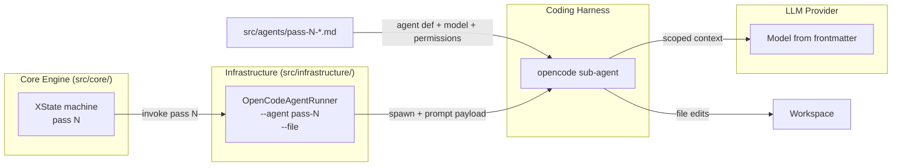

# 5. Agent Prompt System & Routing

> **Target Audience:** Users — CTOs, Team Leads, and Architects evaluating agentic-tdd.
> **Key Goal:** Explain how the 8 passes are *driven* — the Markdown agent files that define each sub-agent, the scope guardrails that keep them from trampling each other, and the model-routing strategy — so evaluators can judge safety, customisation, and cost.
> **Status:** Published (v0.1.0-Beta) — Page 5 of the User Overview. Grounded in `src/agents/pass-*.md` and `src/infrastructure/open-code-agent-runner.ts`; deep prompt-engineering detail is in the Contributor Track.

---

## Executive Summary

The pipeline does not ask one model to "write the feature." Instead, each of the 8 passes is run by a **specialised sub-agent whose entire personality is a single Markdown file**. That file is *both*:

1. **Declarative configuration** (YAML frontmatter) — which model runs the pass, and which tools the agent may touch.
2. **The instruction set** (the body) — the agent's role, rules, scope, and output contract, written in strict XML sections so a code comment can never be mistaken for a command (the primary **prompt-injection defence**).

Two properties make this safe enough for enterprise use:

- **Scope guardrails** — every agent is locked to a narrow tool set (`read`/`edit`/`glob`/`grep` only; no `bash`, no network, no sub-agents). A pass physically cannot undo another pass's verified work (**Agent Trampling** prevention).
- **Static, inspectable routing** — each agent pins its own model in the file's frontmatter. Routing is a YAML line you can read, diff, and override — not a hidden runtime algorithm.

> [!TIP]
> The one-line takeaway: **agents are powerful but scoped.** They can read and edit files, but they cannot run arbitrary commands, reach the network, or spawn sub-agents — and each one knows exactly what it is allowed to produce. See the [Engineering Concepts map](08-engineering-concepts.md) for the full vocabulary.

---

## 1. How Agents Are Defined

Each pass maps to one file in [`src/agents/`](../../../src/agents/): `pass-0-design-agent.md` through `pass-7-documentation-agent.md`. The mapping is a constant table, [`AGENT_NAMES`](../../../src/core/types.ts#L26-L35) in `src/core/types.ts`:

| Pass | Agent file |
|---|---|
| 0 Design | `pass-0-design-agent.md` |
| 1 Contracts | `pass-1-contracts-agent.md` |
| 2 Test Generation | `pass-2-test-generation-agent.md` |
| 3 Core Implementation | `pass-3-core-implementation-agent.md` |
| 4 Refactor | `pass-4-refactor-agent.md` |
| 5 Observability | `pass-5-observability-agent.md` |
| 6 Security Hardening | `pass-6-security-agent.md` |
| 7 Documentation | `pass-7-documentation-agent.md` |

At runtime, [`OpenCodeAgentRunner`](../../../src/infrastructure/open-code-agent-runner.ts#L11-L38) reads that table, spawns the [opencode](https://opencode.ai) CLI with `--agent <name>`, attaches the pass's artefacts via `--file` (the Mermaid design, Gherkin spec, and — on self-correction cycles — the failing test log), and hands over the payload prompt ([`#buildArgs`](../../../src/infrastructure/open-code-agent-runner.ts#L42-L69)).



> [!NOTE] Harness independence
> The engine reaches the agent only through the `IAgentRunner` / `IOpencodeSpawner` ports ([2. High-Level Architecture §3 — B.5](02-high-level-architecture.md#3-key-architectural-decisions)). Swapping opencode for another CLI agent is an adapter change, not a prompt change — the agent files stay the same. See [1. Why This Exists § 2.6](01-why-this-exists.md#26-harness-independence).

### 1.1 File anatomy — configuration + instruction set

Every agent file has the same skeleton. The two parts are *structurally different on purpose*:

| Part | Contents | Role |
|---|---|---|
| **YAML frontmatter** (`---`) | `description`, `mode`, `model`, `permission` | Routing + tool scope — read by the runner |
| `<agent_persona>` | Role, pass number, phase | Identity |
| `<context_philosophy>` | Reframes the injected payload as a *starting point*; mandates `indexer-first` | Context discipline |
| `<directives>` | Numbered `<rule id=…>` requirements (`assess-first`, `no-test-edit`, …) | The rules |
| `<scope>` | Allowed / forbidden operations | Guardrail (declared intent) |
| `<output_spec>` | Exact expected output shape (Passes 0, 1) | Output contract |
| `<security_checklist>` (Pass 6) | OWASP Top-10 checks | Security checklist |
| `<task>` | End-to-end instruction referencing the payload | The task |

The instruction body is written in **strict XML tags** (`` `<directives>` ``, `` `<task>` ``), not Markdown headers. This is the project's primary **prompt-injection defence**: instructions and payload are *semantically walled off*, so a `#` comment in a source file can never be interpreted as a command. Full anatomy: [2. Prompt Engineering — File Anatomy](../contributor-deep-dive/02-prompt-engineering.md#1-file-anatomy).

---

## 2. Scope Guardrails — the Anti-Trampling Lock

Every shipped agent shares the **same tool-permission profile** in its frontmatter (e.g. [`pass-3-core-implementation-agent.md#L12-L19`](../../../src/agents/pass-3-core-implementation-agent.md#L12-L19)):

| Tool | Setting | What it means |
|---|---|---|
| `read` / `edit` / `glob` / `grep` | **allow** | The agent can read and modify files, and search the project |
| `bash` | **deny** | No arbitrary command execution |
| `webfetch` | **deny** | No network access |
| `task` | **deny** | No delegation / no sub-agents |

Combined with the per-pass write intent declared in `<scope>` (e.g. Pass 2 may write *test files only*, Pass 7 *comments/docstrings only*), this is what prevents **Agent Trampling** — one pass silently undoing another pass's verified work. The guardrail is enforced at the tool level, not by asking politely: an agent that cannot run `bash` cannot `git reset`, and an agent denied `edit` on test files cannot "fix" a failing test to make it pass.

> [!NOTE]
> `permission` blocks in the agent files deny the dangerous tools *by declaration*, and opencode's own permission system enforces them per-session. The deny-list approach — explicit `deny` rather than a silent default-allow — is the safety-critical part. See [7. Security Model & Sandboxing](07-security-model.md) and the [glossary's *Agent Trampling* entry](../glossary.md).

The **separation-of-concerns rules** in each file's `<directives>` reinforce the scope boundary per pass:

| Pass | Key constraint |
|---|---|
| 0 Design | Output only `design.mmd` + `spec.gherkin`; no code |
| 1 Contracts | Stubs only; contracts at top of file; no business logic |
| 2 Tests | Test files only; **never** edit source |
| 3 Core | Make tests pass; Mermaid diagram is the binding contract; no logging/docs |
| 4 Refactor | Behaviour-preserving; no API change |
| 5 Observability | Additive only; structured logs; no `print` |
| 6 Security | OWASP checklist; business logic unchanged |
| 7 Docs | Comments/docstrings only; `@see` links to the design artefact |

Two directives recur in every file and are worth knowing about:

- **`assess-first` (the SKIP protocol)** — each agent first checks whether its pass is already satisfied, and if so emits exactly `SKIP:N:reason` and makes **no changes** ([`src/core/skip-parser.ts`](../../../src/core/skip-parser.ts)). This makes passes idempotent no-ops and saves tokens.
- **`indexer-first`** — the agent MUST prefer the `codebase-memory-mcp` knowledge graph over `read`/`glob`/`grep`, and verify the index is current before relying on it. Agents reason from *structure* (call chains, coupling) rather than text pattern-matching — the key guardrail against hallucinating non-existent APIs or duplicating existing utilities (see [1. § 2.4](01-why-this-exists.md#24-reducing-the-non-determinism-of-genai)).

---

## 3. Routing Strategy

Routing is **declarative and configurable at runtime**. Each agent file still pins a fallback `model:` in its frontmatter, but the effective model is resolved from a config file — `config.default.json` (committed template) merged with `.agentic-tdd/config.json` (git-ignored user override) — and passed to opencode as `--model`. Precedence: `--model` flag → `--config <path>` → `.agentic-tdd/config.json` → `config.default.json` → agent-file frontmatter (see [ADR-0009](../adrs/0009-configurable-per-agent-models.md)). The pre-flight log records the effective model and its source ([`#logPreFlight`](../../../src/infrastructure/open-code-agent-runner.ts#L76-L97)).

### 3.1 Shipped defaults (source of truth)

| Pass | Agent file | Shipped `model:` |
|---|---|---|
| 0 Design | `pass-0-design-agent.md#L7` | `openrouter/deepseek/deepseek-v4-pro` |
| 1 Contracts | `pass-1-contracts-agent.md#L11` | `openrouter/deepseek/deepseek-v4-pro` |
| 2 Test Generation | `pass-2-test-generation-agent.md#L8` | `openrouter/deepseek/deepseek-v4-pro` |
| 3 Core Implementation | `pass-3-core-implementation-agent.md#L9` | `openrouter/deepseek/deepseek-v4-flash` |
| 4 Refactor | `pass-4-refactor-agent.md#L9` | `openrouter/deepseek/deepseek-v4-flash` |
| 5 Observability | `pass-5-observability-agent.md#L9` | `openrouter/deepseek/deepseek-v4-flash` |
| 6 Security Hardening | `pass-6-security-agent.md#L9` | `openrouter/deepseek/deepseek-v4-flash` |
| 7 Documentation | `pass-7-documentation-agent.md#L9` | `openrouter/deepseek/deepseek-v4-flash` |

The split follows the recommendation in [3. The 8-Pass Pipeline](03-8-pass-pipeline.md): the *heavy-reasoning* passes (0–2 — design, contracts, tests) run a strong reasoning model, while the *generation & polish* passes (3–7 — implementation, refactor, observability, security, documentation) run the lighter, cheaper `flash` tier. The same values are the committed default in [`config.default.json`](../../../config.default.json).

### 3.2 Overriding the routing

**Runtime config file (recommended):** copy the committed template to the git-ignored override location and edit it:

```bash
cp config.default.json .agentic-tdd/config.json   # then edit .agentic-tdd/config.json
```

The file is sectioned (`agents.models` maps each agent name — the `AGENT_NAMES` values from [`src/core/types.ts`](../../../src/core/types.ts#L26-L35) — to a `provider/model` string). Comments are allowed; keys must match `AGENT_NAMES` exactly.

**CLI flags (per-run):** `--model <provider/model>` overrides every agent for the run; `--config <path>` points at an alternate config file. Frontmatter editing (rebuild via `npm run build`) remains the last-resort fallback.

> [!NOTE] Config-file routing is shipped
> A user-facing **config file** for per-agent models shipped with [ADR-0009](../adrs/0009-configurable-per-agent-models.md), superseding the "planned" item tracked in [discussion #52](https://github.com/Nistapp/agentic-tdd/discussions/52).

> [!NOTE] Aspirational vs shipped
> The widely-cited "Sonnet for design, DeepSeek for logic, Flash for docs, GPT-4.5 for security" routing is **aspirational**, not what ships. The `model:` fields in the table above are the source of truth (see P-2 on [page 1](01-why-this-exists.md)). We have tested with GLM, DeepSeek, and Gemini; the shipped files currently pin DeepSeek.

---

## 4. What This Means for Evaluators

| Question | Answer |
|---|---|
| **Can an agent go rogue?** | No `bash`, no network, no sub-agents — its only power is scoped file edits (see [7. Security Model](07-security-model.md)). |
| **Can a pass break another pass's work?** | Scope guardrails + separation-of-concerns rules make **Agent Trampling** structurally impossible, not just discouraged. |
| **Can I use different models?** | Yes — per-agent models are configured at runtime. Copy `config.default.json` to `.agentic-tdd/config.json` and edit `agents.models`, or override per-run with `--model` / `--config` (§ 3.2). No code changes, no rebuild. |
| **Are the prompts locked to Nistapp?** | The shipped agent files encode Nistapp's internal workflow, but they are plain Markdown designed to be modified for your own conventions, prompts, and models — and routing is config-driven since [ADR-0009](../adrs/0009-configurable-per-agent-models.md). |
| **Is it locked to one vendor?** | No — harness-independent by design (§ 1); model-agnostic via frontmatter. |
| **How much do the prompts cost to maintain?** | They are plain Markdown; `indexer-first` + `assess-first`/SKIP actively avoid wasted tokens (see [6. Context Engineering & Token Savings](06-context-and-token-savings.md)). |

---

## Deep Dive (Contributor Track)

The implementation of everything above lives in the Contributor Track:

| Topic | Where |
|---|---|
| Full file anatomy, the directive catalogue (`assess-first`, `indexer-first`, `target-symbols-priority`, `use-file-changes`), and the permission matrix | [2. Prompt Engineering — Agent Files & Guardrails](../contributor-deep-dive/02-prompt-engineering.md) |
| How the runner spawns opencode, attaches artefacts, and persists logs | [4. Infrastructure Adapters](../contributor-deep-dive/04-infrastructure-adapters.md) · [`open-code-agent-runner.ts`](../../../src/infrastructure/open-code-agent-runner.ts) |
| How SKIP / retries are orchestrated by the machines | [1. Core Engine Internals §6 — Skip Signals](../contributor-deep-dive/01-core-engine-internals.md#6-skip-signals) |
| Adding / modifying a pass end-to-end | [2. Prompt Engineering §5](../contributor-deep-dive/02-prompt-engineering.md#5-adding--modifying-a-pass) · [8. Developer Guide](../contributor-deep-dive/08-developer-guide.md) |

---

## Placeholders / Open Questions

| # | Topic | What is missing |
|---|---|---|
| R-1 | Config-file routing | **Shipped** — per-agent models resolve from `config.default.json` + `.agentic-tdd/config.json` with `--model`/`--config` overrides ([ADR-0009](../adrs/0009-configurable-per-agent-models.md)). See § 3.2. |
| R-2 | Model routing truth | Re-confirm exact current `model:` per pass when agent files change — the table in § 3.1 is a snapshot. |
| R-3 | Security-pass orchestration | A dedicated security orchestrator / swarm of security sub-agents is an open idea ([discussion #28](https://github.com/Nistapp/agentic-tdd/discussions/28)) — planned, not shipped. |

---

## Related Pages

- Previous: [4. The Core Engine](04-core-engine.md)
- Next: [6. Context Engineering — Code Indexing & Token Savings](06-context-and-token-savings.md)
- Deep dives: [2. Prompt Engineering](../contributor-deep-dive/02-prompt-engineering.md) · [3. Context Engineering](../contributor-deep-dive/03-context-engineering.md)
- Related: [3. The 8-Pass Pipeline](03-8-pass-pipeline.md) · [8. Engineering Concepts](08-engineering-concepts.md) · [Glossary](../glossary.md)
