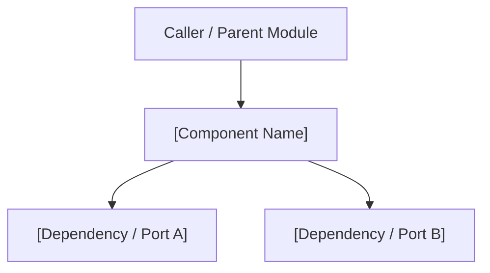

# [Component / Module Name] Architecture Overview

> **Target Audience:** [CTOs / Tech Leads / Senior Engineers]  
> **Key Goal:** [1-sentence statement of what this component solves]

---

## 1. Executive Summary & Context

> [!NOTE]
> **High-Level Rationale:** Explain why this component exists and its position in the system.

- **Primary Responsibility:** [Concise description]
- **Layer:** [`src/core/` (pure engine) | `src/infrastructure/` (adapter) | `src/cli/` (entry)]
- **State Coupling:** [Stateless / Stateful / XState Machine]

---

## 2. Component Diagram & Data Flow

### Data Flow Walkthrough
1. **Input:** [Describe input params/events]
2. **Processing:** [Describe internal steps or state transitions]
3. **Output / Side-Effects:** [Describe return value, emitted events, or file outputs]

---

## 3. Core Invariants & Architectural Rules

- **Invariant 1:** [e.g., Zero direct file system or git imports in src/core/]
- **Invariant 2:** [e.g., Must handle cancellation cooperatively]
- **Invariant 3:** [e.g., All errors must be wrapped in custom error classes]

---

## 4. Code Map & Key Symbols

| Symbol / Interface | File Path & Line Anchors | Role |
|---|---|---|
| `[MainClassName]` | [`src/path/file.ts#L10-L45`](../../src/path/file.ts#L10-L45) | Primary implementation |
| `[IPortInterface]` | [`src/core/interfaces.ts#L20-L35`](../../src/core/interfaces.ts#L20-L35) | Injected dependency port |

---

## 5. Trade-offs & Known Limitations

- **Trade-off:** [What was sacrificed for performance/modularity?]
- **Known Limit:** [What edge case requires human intervention or future refactoring?]

---

## 6. Related Specifications & ADRs

- [ADR-000X: Related Decision](../architecture/adrs/0001-pure-core-engine.md)
- [Design Spec / Artifact](../../docs/architecture-manifesto.md)
